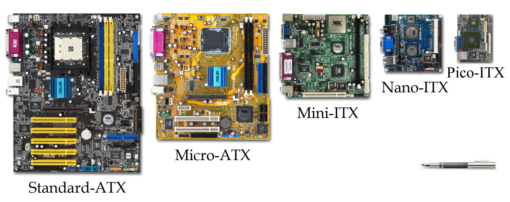

-------------------------------------------------------------------------------
# Google IT support — Fundamentals of IT

<!-- MarkdownTOC -->

- [1. Introduction to IT](#1-introduction-to-it)
    - [1.1. Brief history of computing](#11-brief-history-of-computing)
    - [1.2. Digital logic](#12-digital-logic)
    - [1.3. Computer architecture](#13-computer-architecture)
- [2. Hardware](#2-hardware)
    - [2.1. The modern computer](#21-the-modern-computer)
    - [2.2. CPU](#22-cpu)
    - [2.3. RAM](#23-ram)
    - [2.4. Motherboard](#24-motherboard)
    - [2.5. Storage](#25-storage)
    - [2.6. Power supply, batteries and charging systems](#26-power-supply-batteries-and-charging-systems)
    - [2.7. Mobile devices](#27-mobile-devices)
    - [2.8. Peripherals](#28-peripherals)
    - [2.9. BIOS and UEFI](#29-bios-and-uefi)
    - [2.10. Building up PC](#210-building-up-pc)
- [3. Operating System](#3-operating-system)
    - [3.0. Remote connection](#30-remote-connection)
    - [3.1. Components of an OS](#31-components-of-an-os)
    - [3.2. File management](#32-file-management)
    - [3.3. Process management](#33-process-management)
    - [3.4. Memory management](#34-memory-management)
    - [3.5. I/O management](#35-io-management)
    - [3.6. User space](#36-user-space)
    - [3.7. Logs and the boot process](#37-logs-and-the-boot-process)
- [4. Networking](#4-networking)
    - [4.1. Basics of networking](#41-basics-of-networking)
    - [4.2. Networking hardware and protocols](#42-networking-hardware-and-protocols)
    - [4.3. The Web](#43-the-web)
- [5. Software](#5-software)
    - [5.1. Introduction to software](#51-introduction-to-software)
    - [5.2. Programming languages](#52-programming-languages)
- [6. Troubleshooting](#6-troubleshooting)
    - [6.1. Troubleshooting practices](#61-troubleshooting-practices)
    - [6.2. Customer service](#62-customer-service)

<!-- /MarkdownTOC -->

-------------------------------------------------------------------------------
## 1. Introduction to IT

**IT** is the use of digital technology, computers and the Internet, to store data and process it into useful information.

**IT support**: managing, installing, maintaining, troubleshooting and configuring office and computing equipment. 

### 1.1. Brief history of computing

**Computer** is a device that stores and processes data by performing calculations.

**Algorithm** is a series of steps that solves a specific problem.

- 500 BCE: *Abacus* (one of the earliest known computer)
- 1642: Blaise Pascal invented a *mechanical calculator*
- 1800: Joseph Jacquard invented a *programmable loom* (for textile industry; used *punch cards* to store data)
- Charles Babbage developed a series of advanced mechanical calculators: *Difference Engine*, *Analytical Engine* etc.
- Ada Lovelace had realised the universality of these machines and developed the first algorithm for *Analytical Engine* (which made it first *general purpose computing machine*)
- WWII boosted the growth of computer technologies and computer science (because of cryptography)
- magnetic tape changed punch cards: more data and more reliable media
- transistors changed vacuum tubes: more convenient and break resistant
- Grace Hopper invented first *compiler* (to automatically translate programs written in high-level languages into machine code)
- hard disk drives, microprocessors, programming languages
- personal computers: Xerox Alto PC (with GUI), Apple, IBM, Windows, video games
- Ken Thompson and Dennis Ritchie developed Unix
- Richard Stallman developed GNU, an open-source free Unix-like OS
- Linus Torvalds developed Linux on the base of GNU
- PDAs (personal digital assistants), which led to smartphones


### 1.2. Digital logic

Computers use **binary system** (base-2 numeral system). Binary digits (**bits**) are grouped into 8-packs (**bytes**). Number 8 is just a historical accident that became industry standard (2^8^ = 256 possible byte values). Binary in modern computers is implemented via transistors (using electric voltage) and logic gates.

Examples:

1. We need **character encoding** for bytes-to-characters translation. **ASCII** is the oldest character encoding standard, but eventually 256 characters wasn't enough. **UTF-8** is a modern standard, which allows to store each character in more than one byte.
   
    ```
    01101000 01100101 01101100 01101100 01101111 = hello (in ASCII)
    ```

2. There are many different standards for color representation, but the most basic one is RGB (3 characters for pixel brightness).


### 1.3. Computer architecture

Computer architecture can be represented with four layers of abstraction: *hardware*, *operating system*, *software*, and *users*.

<p style="text-align:center;"></p>

<!-- @startuml
:Users;
note right
interact with a computer
end note
:Software;
note right
how users interact with a computer
end note
:Operating System;
note right
allows hardware to communicate with the system
end note
:Hardware;
note right
made up of the physical components of a computer
end note
@enduml -->


-------------------------------------------------------------------------------
## 2. Hardware

### 2.1. The modern computer

Every computer has a **power outlet** (for power supply) and **ports** (connection points for external hardware that enhance the functionality of a computer).

Computation process:

- Programs are instructions that tell the computer what to do, they are run on a **CPU (central processing unit)** as binary commands in machine code.
- **EDB (external data bus)** is a row of wires that interconnects the parts of a computer (EDB sizes: 8, 16, 32 and 64 bit).
- *Registrars* (inside the CPU) are responsible for storing the data that the CPU works with
- Only one line of data can be sent through the EDB at a time, so CPU-RAM communications are managed by another component, the **MCC** (**memory controller chip**). The MCC is a bridge between the CPU and **RAM (random-access memory)**.
- The CPU talks to the MCC through **address bus** and asks for instructions. The MCC finds the instructions in RAM, grabs the data, and sends it back to the CPU through the EDB.
- There is also the memory that is stored directly on CPU: **cache**. Three [*cache*](https://en.wikipedia.org/wiki/CPU_cache) levels: L1, L2, and L3 (L1 is the smallest and the fastest).
- CPU has an *internal clock* that keeps its operations in sync (i.e., to know when the set of instruction ends, and a new one begins). It connects to a special wire called *clock wire*. When a voltage is sent to the *clock wire*, it's referred to as a **clock cycle**.
- **Clock speed** of the CPU is the maximum number of *clock cycles* that it can handle in a certain time period (**overclocking** is the way to exceed the clock speed of the CPU in order to perform more tasks).

<p style="text-align:center;"></p>


### 2.2. CPU

- **Instruction set** is a list of instructions that CPU is able to run (hard-coded into the CPU, different manufacturers use different *instruction sets*, e.g., x86 and ARM).
- CPU needs to be compatible with a motherboard. Two major types of CPU *sockets*: **LGA (land grid array)** and **PGA (pin grid array)**.
- **Heat sink** is used to take the heat away from CPU and dissipate it through a fan or another medium.
- [Two types](https://en.wikipedia.org/wiki/64-bit_computing#32-bit_vs_64-bit) of CPU architecture: 32 bit and 64 bit (specifying how much data CPU can efficiently handle).

<p style="text-align:center;"></p>


### 2.3. RAM

**RAM** is a computer's short term memory, which is used to store data that needs quick access (this data changes all the time).

- To run a program computer needs to make a copy of it in RAM, so that CPU could process it.
- Most common type of RAM is **DRAM (dynamic random-access memory)**. Data on DRAM is stored in microscopic capacitors that are put into chips on RAM. 
- There are also different types of memory states that DRAM chips can be put on. The more modern **DIMM** sticks (**dual inline memory module**) have different sizes of pins on them.
- **SDRAM (synchronous DRAM)** is synchronized to system's clock speed allowing for quicker processing of data. In today's systems, **DDR SDRAM** (**double data rate SDRAM**) is used (DDR is faster, takes up less power, and has a larger capacity than earlier SDRAM versions).

<p style="text-align:center;"></p>


### 2.4. Motherboard

Motherboard:

- lets expand computer functionality by adding expansion cards
- routes power from the power supply
- allows different parts of the computer to communicate with each other

**Key motherboard characteristics**:

1. **Chipset**

    A *chipset* is a key component of motherboard that allows manage data between CPU, RAM, and peripherals (i.e., *chipset* defines how components of a computer talk to each other). The *chipset* is made up of two chips: **Northbridge**, that interconnects stuff like RAM and video cards, and **Southbridge**, which maintains I/O controllers like hard drives and USB devices. In some modern CPUs, the *Northbridge* has been directly integrated into the CPU so there isn't a separate *Northbridge chipset*.

    <p style="text-align:center;"></p>

2. **Expansion slots**

    Give the ability to increase the functionality of a computer. Modern standard: **PCI Express (peripheral component interconnect express)**.

    <p style="text-align:center;"></p>

3. **Form factor**

    There are different sizes of motherboards. The most common *form factor* is **ATX** (**advanced technology eXtended**), that comes in different sizes too. Another one is **ITX (information technology eXtended)**, which is much smaller than ATX.

    <p style="text-align:center;"></p>


### 2.5. Storage

There are two basic storage types used today:

1. **HDDs (hard disk drives)**
    - use a spinning platter and a mechanical arm to read and write information
    - key characteristic: the platter rotation speed (measured in RPMs)
    - more affordable, but more prone to damage
2. **SSDs (solid state drives)**
    - have no moving parts
    - information is stored on microchips and data travels a lot faster

Interfaces for connection: **SATA (serial ATA)** (the most popular ATA interface; hot swappable, i.e., you don't have to turn off computer to plug it in) and **NVMe (NVM Express)** (new fast SSD interface; the drive is added as an expansion slot).

On the difference between [kB, KB and KiB](https://en.wikipedia.org/wiki/Kilobyte):
```
1 kB = 1000 bytes
1 KiB = 1024 bytes
```


### 2.6. Power supply, batteries and charging systems

- Power supply converts AC (*alternating current*) to low-voltage DC (*direct current*). Key characteristic: *wattage* of the **PSU (power supply unit)**.
- Rechargeable devices might have an *external charger* for removable batteries, a *cradle stand* or a *wireless charger*. Rechargeable batteries have a limited lifespan which is measured in **charge cycles**. 
- External power source is used to add power to a battery. This could come from a wall outlet or another battery. You also need a charging circuit that manages the power transfer from the external power source to the rechargeable battery, it makes sure the input power is converted to the correct output power.
- [Safe handling of lithium-ion batteries](https://www.osha.gov/dts/shib/shib011819.html).


### 2.7. Mobile devices

The smaller the device, the more integrated its components usually are (CPU, RAM, and storage might be soldered directly to motherboard). Very small mobile devices use a **SoC (system on a chip)**; it packs the CPU, RAM, and sometimes even the storage onto a single chip. SoC also use less battery power.


### 2.8. Peripherals

**Peripheral** is anything that's connected to a computer externally that adds functionality.

- USB (*universal serial bus*) devices are the most popular connections
- DVI (only video), HDMI (audio and video), VGA, Display Port (video and audio)
- etc.


### 2.9. BIOS and UEFI

External devices (keyboards, webcams, printers, etc.) use special programs to tell the CPU how to run them, these programs are called **drivers** (or **services**). **BIOS (basic input output system)** tells CPU what devices are connected to computer. BIOS is software that helps initialize the hardware, and gets operating system up and running. 

- BIOS is stored in a special type of memory called **ROM-chip (read-only memory chip)**. Unlike RAM, ROM is non-volatile, meaning it won't erase the data if the computer is turned off.
- There is also BIOS alternative called **UEFI (unified extensible firmware interface)**. UEFI performs the same function as BIOS, but it's more modern and has better compatibility and support for newer hardware.
- When computer turns on, it runs a **POST (power on self test)** to make sure all the hardware is working correctly (hence beeping sounds). POST figures out what hardware is connected to the computer, it happens before BIOS initializes any hardware or loads up essential drivers. If there is an issue, there is no way to display it on the screen, instead, the computer can usually produce a series of beeps, which will help identify the problem.
- There is a special chip on a motherboard called the **CMOS battery**, it stores data about booting (e.g., date, time and start up settings). These settings can be changed in the BIOS settings menu.


### 2.10. Building up PC

0. Prevent unwanted static from harming computer components
    - touch pluged-in but not powered-on electrical device every couple of minutes
    - or wear anti-static wristband
1. Motherboard
    - attach motherboard to the case via standoffs
2. CPU
    - line up the CPU with the motherboard's socket (with the help of a marker)
    - secure CPU in the socket
3. Heat sink
    - apply an even amount of thermal paste on CPU
    - take heat sink and press it against the CPU
    - tighten down the sockets with a screw diver
    - plug molex connector to the motherboard (controls fan's speed)
4. RAM
5. Hard drive
6. Case fans
7. PSU


-------------------------------------------------------------------------------
## 3. Operating System

### 3.0. Remote connection

1. **SSH (secure shell)**
    - Linux: openSSH
    - Windows: PuTTY
2. **RDP (remote desktop protocol)**
    - Linux: realVNC
    - Windows: mstsc.exe (Microsoft terminal services client); to enable: Control Panel → System → Remote settings → Remote desktop
3. **VPN**


### 3.1. Components of an OS

OS manages computer's resources and lets user interact with it. Two main parts of any OS: **kernel** (the main core of an OS) and **user space** (everything outside the kernel).

<p style="text-align:center;"></p>

**Kernel**:

- **file management** (file storage and file management)
- **process management** (managing run order of processes, resources, time, etc.; **process scheduler** is the part of kernel that makes this multitasking possible)
- **memory management** (kernel optimizes memory usage)
- **I/O management** (management of disks, keyboards, monitors, networks, connections, audio devices, etc.)


### 3.2. File management

There are three main components to handling files on an OS:

1. **File system** defines

    - supported data volume
    - speed at which system operates
    - resiliency towards file corruption
    - etc.

    The major OS manufacturers have their own unique *file systems* (in general they don't play nicely with each other).

    - Windows: **NTFS** (encryption, faster access speed, security, etc), ReFS
    - MacOS: **APFS** (journaled)
    - Linux: different distros have different FS (standard: **ext4**)

2. **File data**

    Data is stored in the form of **data blocks**. Data is usually broken in pieces and written to different parts of the disk. Block storage provides quicker data access and is better for utilizing storage space.

3. **Metadata**

    *Metadata* contains the information about a file: file owner, permissions, file type, file size, date modified, etc.


### 3.3. Process management

1. **Process creation**

    **Program** is an application that a user can run, and a **process** is a program that's executing, i.e., user can have many processes of the same program running at the same time (e.g., browser tabs of a web browser).

2. **Process scheduling**

    When user runs programs, OS dedicates computer resources to them. Since resources are finite, kernel has to manage them efficiently. It has to schedule time for the CPU to execute the instructions of the processes one by one (**time slice** is a short interval of time that gets allocated to a process for CPU execution).

    Computer can run slowly when CPU resources are maxed out, e.g., when one process is taking up more *time slices* than it should or when there are too many processes that want CPU time.

3. **Process termination**

    When a process is terminated, it releases all the previously used resources back to the kernel.


### 3.4. Memory management

When you execute a process, the data of the program is split into chunks called **pages**. *Pages* are stored in **virtual memory** (combination of hard drive space and RAM). **Swap space** is an allocated for *virtual memory* hard drive space.

<p style="text-align:center;"></p>

*Virtual memory* is used instead of RAM for efficiency (you never need all the data from the application at once), so *pages* are sent to physical memory or RAM only when they are read or executed. Analogy: you don't need to read the whole cookbook just for one recipe.


### 3.5. I/O management

Kernel loads up drivers for I/O devices and manages communications and data transfer between hardware. It figures out the most efficient data transfer methods and makes sure data hasn't been corrupted during transmission.


### 3.6. User space

Ways of interacting with an OS:

- **CLI shell** (*command-line interface*)

    **Shell** is a program that interprets text commands and sends them to the OS to execute (e.g., *bash* on Linux, *PowerShell* on Windows).

- **GUI** (*graphical user interface*)
- **system applications and libraries** (log in, system settings, etc.)


### 3.7. Logs and the boot process

**Logs** are files that record system events on a computer (logs are useful for troubleshooting).

**The Boot Process**:

1. Power On
2. BIOS/UEFI runs POST (power on self test)
3. Bootloader
    - boot device selection (based on boot order configuration in BIOS/UEFI)
    - search and lunch of a **Bootloader** (small program that loads the OS)
3. Loading OS, Kernel and drivers
4. Essential system processes and user space

<p style="text-align:center;"></p>


-------------------------------------------------------------------------------
## 4. Networking

### 4.1. Basics of networking

**Network** is an interconnection of computers.

**Networking** is managing, building and designing computer networks.

**The Internet** is composed of a massive network of satellites, cellular networks, and physical cables buried beneath the ground. Clients access *the Internet* through servers by connecting to a network run by an **ISP (internet service provider)**. Data is sent through a network by packets.

- **IP address**: an identifier of a computer on a network.
- **MAC address**: (usually) hard-coded network address of a device.

Analogy: IP address is house address, MAC address is name of the recipient.


### 4.2. Networking hardware and protocols

- Computers connect to networks with: *ethernet cables*, *wi-fi* and *fiber optic cables*.
- Computers connect to networks through: *routers*, *switches* and *hubs*.

<p style="text-align:center;"></p>

**Network stack** is a set of hardware or software that provides the network infrastructure for a computer, i.e., all the components that makes up computer networking.

**Network protocol** is a set of rules for transfering data in a network (e.g., TCP, or *transmission control protocol*; IP, or *internet protocol*).

*Network protocols* make sure that packets are routed efficiently, aren't corrupted, are secure, go to the right machine and are named appropriately.


### 4.3. The Web

**Websites** are text documents formated with **HTML** (**hypertext markup language**; a coding language used by web browsers).

For convenience web browsers use *urls (uniform resource locator)* and *domain addresses* (instead of IP addresses). *Domain names* are registered by ICANN (the Internet Corporation for Assigned Names and Numbers). 

- IPv4: 32 bits separated into four groups
- IPv6: 128 bits separated into eight groups

There are approximately 4.3 billion IPv4 addresses, but there are way more websites today. Mitigation tools: IPv6 and **NAT (network address translation)**, which lets organizations use one *public IP* address and many *private IP* addresses within the network.


-------------------------------------------------------------------------------
## 5. Software

### 5.1. Introduction to software

**Coding** is translating one language to another.

**Scripting** is coding in a scripting language (scripts are used to perform a single or limited range task). 

**Programming** is coding in a programming language.

Software:

1. *Application software*: created to fulfill a specific need (i.e., text editor, web browser, etc.).
2. *System software*: used to keep system running (e.g., OS tools and utilities).

    *Firmware* is a system software that's permanently stored on a computer component (e.g., BIOS).


### 5.2. Programming languages

**Assembly** was the first programming language, that allowed the use of human readable instructions, assembled into code.

- A program that was written for a specific CPU, was able to run only on that CPU. **Compiled languages** solved this issue, they use human readable instructions and send them through a **compiler** to produce machine code (Grace Hopper, 1959).
- Another option: **Interpreted languages**. Interpreted code isn't compiled ahead of time, but run by an **interpreter**, which interprets the code into CPU instructions just in time to run them. A file that has code written in one of these languages is usually called a **script**.


-------------------------------------------------------------------------------
## 6. Troubleshooting

### 6.1. Troubleshooting practices

**Troubleshooting** is ability to diagnose and resolve a problem.

- Ask questions.
- Positive user experience (IT support is about working in the service of others).
- Isolate the problem (shrink the scope of your problem to find the root cause).
- Follow the cookie crumbs (go back when the problem first started and work forward from there).
- Start with the quickest step.

Pitfalls to avoid:

- Going into autopilot
- Not finding the root cause


### 6.2. Customer service

Great customer service requires exhibiting **soft skills**: empathy, being conscious of your tone, acknowledging the person you're talking to and developing trust with the user. 

Documentation:

- **ticketing (bugs) system** (e.g., bugzilla, JIRA, Redmine)
- **procedures and policies** to create a documentation trail (important to update documentation).

