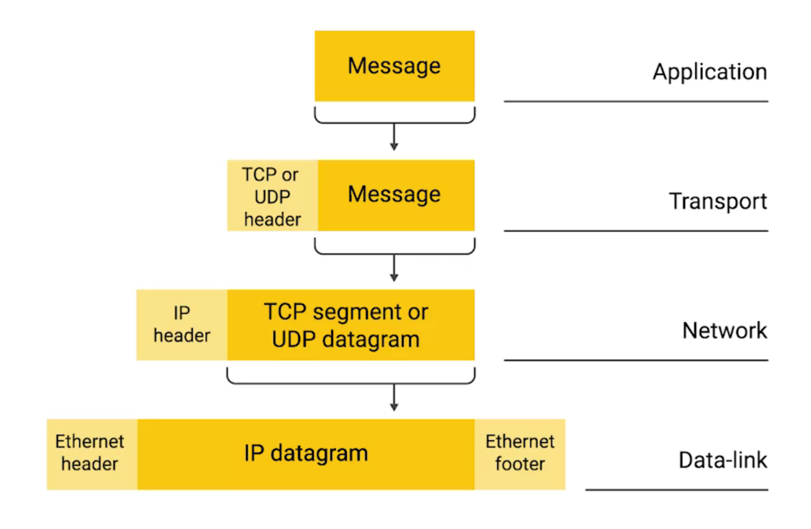
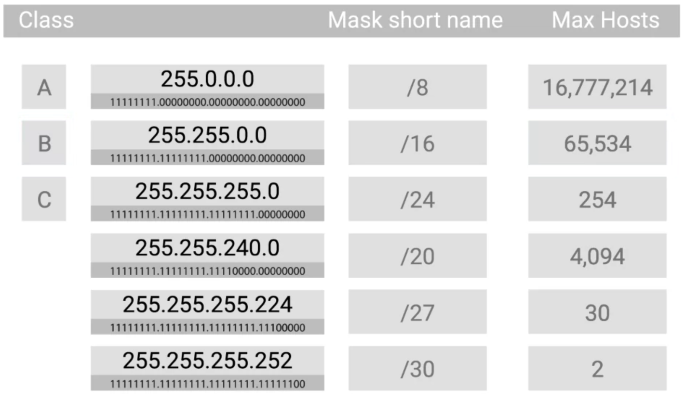
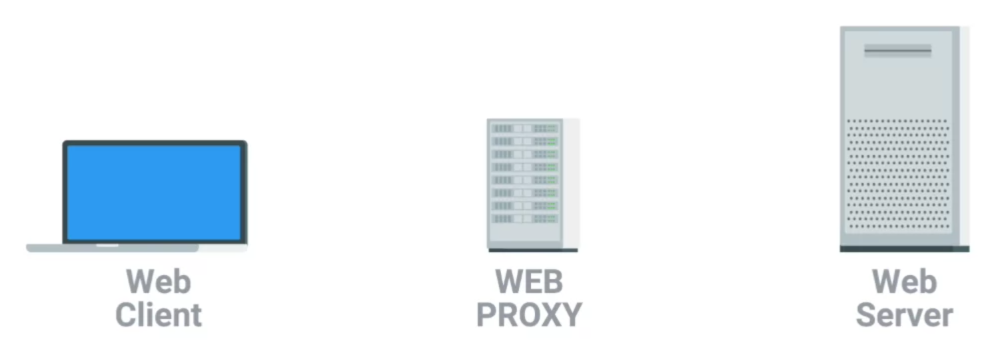
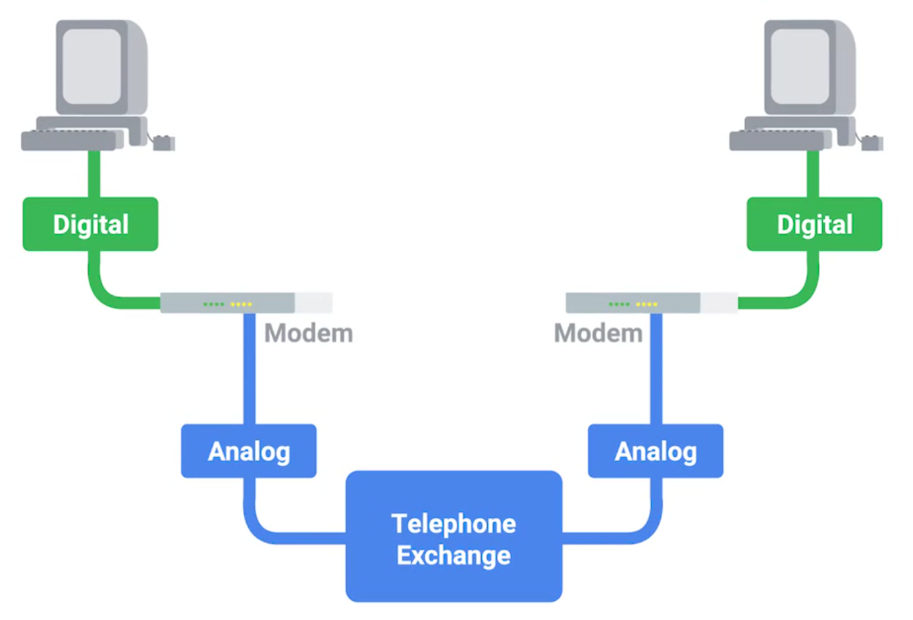

-------------------------------------------------------------------------------
# Google IT support — Networking

<!-- MarkdownTOC -->

- [1. The TCP/IP network model](#1-the-tcpip-network-model)
- [2. Network devices](#2-network-devices)
    - [2.1. Cables](#21-cables)
    - [2.2. Hubs and switches](#22-hubs-and-switches)
    - [2.3. Routers](#23-routers)
    - [2.4. Servers and clients](#24-servers-and-clients)
- [3. The physical layer](#3-the-physical-layer)
    - [3.1. Binary across the wire](#31-binary-across-the-wire)
    - [3.2. Ethernet over twisted pair](#32-ethernet-over-twisted-pair)
    - [3.3. Network ports](#33-network-ports)
    - [3.4. Patch panels](#34-patch-panels)
- [4. The data link layer](#4-the-data-link-layer)
    - [4.1. Ethernet](#41-ethernet)
    - [4.2. MAC address](#42-mac-address)
    - [4.3. Unicast, multicast, and broadcast](#43-unicast-multicast-and-broadcast)
    - [4.4. Ethernet frames](#44-ethernet-frames)
- [5. The network layer](#5-the-network-layer)
    - [5.1. IP address](#51-ip-address)
    - [5.2. IP datagrams and encapsulation](#52-ip-datagrams-and-encapsulation)
    - [5.3. IP address classes](#53-ip-address-classes)
    - [5.4. Address resolution protocol](#54-address-resolution-protocol)
    - [5.5. Subnetting](#55-subnetting)
    - [5.6. CIDR](#56-cidr)
    - [5.7. Routing](#57-routing)
    - [5.8. Routing tables](#58-routing-tables)
    - [5.9. Routing protocols](#59-routing-protocols)
    - [5.10. Non-routable address spaces](#510-non-routable-address-spaces)
- [6. The transport layer](#6-the-transport-layer)
    - [6.1. Multiplexing and demultiplexing](#61-multiplexing-and-demultiplexing)
    - [6.2. TCP segment](#62-tcp-segment)
    - [6.3. TCP control flags](#63-tcp-control-flags)
    - [6.4. Establishing and closing TCP connections](#64-establishing-and-closing-tcp-connections)
    - [6.5. TCP socket states](#65-tcp-socket-states)
    - [6.6. Connection-oriented and connectionless protocols](#66-connection-oriented-and-connectionless-protocols)
    - [6.7. System and ephemeral ports](#67-system-and-ephemeral-ports)
    - [6.8. Firewalls](#68-firewalls)
- [7. The application layer](#7-the-application-layer)
    - [7.1. OSI model](#71-osi-model)
    - [7.2. Networking in details](#72-networking-in-details)
- [8. Networking services](#8-networking-services)
    - [8.1. DNS and name resolution](#81-dns-and-name-resolution)
    - [8.2. DNS and transport layer protocols](#82-dns-and-transport-layer-protocols)
    - [8.3. Resource record types](#83-resource-record-types)
    - [8.4. Anatomy of a domain name](#84-anatomy-of-a-domain-name)
    - [8.5. DNS zones](#85-dns-zones)
    - [8.6. DHCP](#86-dhcp)
    - [8.7. DHCP discovery](#87-dhcp-discovery)
    - [8.8. NAT](#88-nat)
    - [8.9. Limits of IPv4](#89-limits-of-ipv4)
    - [8.10. VPN](#810-vpn)
    - [8.11. Proxy services](#811-proxy-services)
- [9. Connecting to the Internet](#9-connecting-to-the-internet)
    - [9.1. Dial-up](#91-dial-up)
    - [9.2. Broadband connections](#92-broadband-connections)
    - [9.3. WAN and point-to-point VPN](#93-wan-and-point-to-point-vpn)
    - [9.4. Wireless networking](#94-wireless-networking)
    - [9.5. Wireless network configurations](#95-wireless-network-configurations)
    - [9.6. Wireless channels](#96-wireless-channels)
    - [9.7. Wireless security](#97-wireless-security)
    - [9.8. Cellular networks](#98-cellular-networks)
- [10. Troubleshooting](#10-troubleshooting)
    - [10.1. ICMP](#101-icmp)
    - [10.2. Ping](#102-ping)
    - [10.3. Traceroute](#103-traceroute)
    - [10.4. Testing port connectivity](#104-testing-port-connectivity)
    - [10.5. Name resolution tools](#105-name-resolution-tools)
    - [10.6. Public DNS servers](#106-public-dns-servers)
    - [10.7. DNS registration and expiration](#107-dns-registration-and-expiration)
    - [10.8. Host files](#108-host-files)
- [11. The future of networking](#11-the-future-of-networking)
    - [11.1. The cloud](#111-the-cloud)
    - [11.2. IPv6 addressing](#112-ipv6-addressing)
    - [11.3. IPv6 datagram](#113-ipv6-datagram)
    - [11.4. IPv6 and IPv4](#114-ipv6-and-ipv4)

<!-- /MarkdownTOC -->

-------------------------------------------------------------------------------
## 1. The TCP/IP network model

1. **Physical layer**
    - represents the physical devices that interconnect computers
    - includes specifications for the networking cables and the connectors that join devices together
    - includes specifications describing how signals are sent over these connections

2. **Data link layer** (or *network interface*, or *network access layer*)
    - responsible for defining a common way of interpreting signals between devices on the same network
    - responsible for transmitting data across a single link
    - most common protocols: **Ethernet** and **Wi-Fi**

3. **Network layer** (or *internet layer*)
    - responsible for getting data delivered across a collection of networks, i.e., allows different networks to communicate with each other through *routers*
    - responsible for transmitting data between two individual nodes
    - **internetwork** is a collection of networks connected together through routers (e.g., *the Internet*)
    - most common protocol: **IP (internet protocol)**
    - **network software**: *client* (application initiating a request for data) and *server* (software answering the request across the network)

4. **Transport layer**
    - responsible for ensuring that data gets to the right client and server programs
    - most common protocols: **TCP (transmission control protocol)** and **UDP (user datagram protocol)**
    - TCP provides mechanisms to ensure that data is reliably delivered, and UDP does not

5. **Application layer**:
    - a lot of application specific protocols

<p style="text-align:center;"></p>

Analogy: *the physical layer* is the delivery truck and the roads; *the data link layer* is how the delivery trucks get from one intersection to the next; *the network layer* identifies which roads need to be taken to get from address A to address B; *the transport layer* ensures that delivery driver knows how to knock on your door to tell you your package has arrived; *the application layer* is the contents of the package itself.

<p style="text-align:center;"></p>

- traditional TCP/IP model has four layers (*physical layer* is included in *data link layer*)
- there are other network models, e.g., **OSI model** (*open systems interconnection*). It has [seven layers](https://en.wikipedia.org/wiki/OSI_model) (*application layer* is divided into three pieces)
- [Wireshark (packet analyzer)](https://www.wireshark.org/)


-------------------------------------------------------------------------------
## 2. Network devices

### 2.1. Cables

**Copper cables**:

- most common; made up of multiple pairs of copper wires inside a plastic insulator
- binary data: by changing the voltage between two ranges (see [Ben Eater tutorial](https://www.youtube.com/watch?v=XaGXPObx2Gs))
- most common categories of copper **twisted pair** cables: *Cat5*, *Cat5e*, and *Cat6* (they have different physical characteristics, e.g., the number of twists in the pair that results in different usable lengths, transfer rates and resistance to outside interference)
- *Cat5e* has less crosstalk than *Cat5*, and *Cat6* has less than *Cat5e* (*crosstalk* is when an electrical pulse on one wire is accidentally detected on another wire); less crosstalk means less data needs to be re-transmitted, i.e., higher transfer rate
- *Cat6* has a shorter maximum transfer distance when used at higher speeds

**Fiber** (or *fiber optic cables*):

- made up of many individual optical fibers (tiny glass tubes)
- binary data: by light pulses
- often used in environments with a lot of electromagnetic interference (e.g., in data centers)
- generally transport data quicker than copper cables, but much more expensive and fragile; also can transport data over much longer distances than copper without data loss
- used for [transcontinental underwater cables](https://www.youtube.com/watch?v=kx3qwqtZvs4)


### 2.2. Hubs and switches

Used to connect devices on the same network (**LAN**, or **local area network**).

<p style="text-align:center;"></p>

**Hub** is a *physical layer* device that allows for connections from many computers at once.

- devices connected to a *hub* talk to each other at the same time
- each system has to determine if the incoming data was sent to them or not; this causes a lot of noise on the network and creates a **collision domain** (network segment where only one device can communicate at a time)
- *collision domain* causes systems to wait for a quiet period before they try sending their data and it slows down network communications a lot, which is the primary reason why *hubs* are fairly rare today

**Network switch** is a *data link layer* device that allows for connection from many computers at once.

- similar to a *hub*, but *switch* can inspect the contents of the Ethernet protocol data, determine which system it is intended for and then send that data only to that one system
- *switches* reduce (or completely eliminate) the size of *collision domains* on a network


### 2.3. Routers

Used to connect devices on different networks.

<p style="text-align:center;"></p>

**Router** is a *network layer* device that allows to forward data between independent networks.

- can inspect IP data to determine where to send it
- stores internal tables containing information about how to route traffic between networks
- most common type of a router: in a home network, or a small office. They route traffic from LAN to the *ISPs core routers*. These core routers form the *backbone of the Internet*.
- routers communicate with each other via **BGP (border gateway protocol)**, which lets them learn about optimal paths to forward traffic


### 2.4. Servers and clients

**Client** is something that requests data.

**Server** is something that provides data to a client.

<p style="text-align:center;"></p>

- individual programs running on the same node can be servers and clients to each other too
- each node can be both a client and a server at the same time, so the separation is not strict, e.g., since primary purpose of e-mail service is to serve data to clients we can refer to it as an email server, even though it's itself a client of a DNS server


-------------------------------------------------------------------------------
## 3. The physical layer

### 3.1. Binary across the wire

The *physical layer* consists of devices and means of transmitting bits across computer networks. A standard copper network cable will carry a constant electrical charge and binary is encoded through modulation, or **line coding**. 

<p style="text-align:center;"></p>


### 3.2. Ethernet over twisted pair

The most common connection type used in computer networking is known as **twisted pair** (pairs of copper wires that are twisted together). These pairs act as a single conduit for information, and their twisted nature protects signal against electromagnetic interference and crosstalk from neighboring pairs.

*Cat6* cable has eight wires consisting of four twisted pairs inside a single jacket. Exactly how many pairs are in use depends on the transmission technology being used. 

<p style="text-align:center;"></p>

**Simplex communication**: information can flow only unidirectionally across the cable.

**Duplex communication**: information can flow in both directions across the cable (e.g., phone call).

<p style="text-align:center;"></p>

To ensure *duplex communication* networking cables reserve one or two pairs for communicating in one direction, and the other one or two pairs in another direction.

- *Full-duplex*: devices can communicate with each other at the exact same time.
- *Half-duplex*: only one device can be communicating at a time (if there's something wrong with the connection).

[Ethernet over twisted pair technologies](https://en.wikipedia.org/wiki/Ethernet_over_twisted_pair) are the communication protocols that determine the volume of data that can be transfered, transfer rate and the distance at which quality of this data begins to degrade.


### 3.3. Network ports

Twisted pair network cables are terminated with a plug that takes the individual internal wires and exposes them. The most common plug: **RJ-45** (*registered jack 45*).

A network cable with an *RJ-45 plug* can connect to an **RJ-45 network port**. *Network ports* are generally directly attached to the devices. *Switches* have many network ports (because their purpose is to connect many device), while servers and desktops usually only have one or two.

Most network ports have two LEDs: *link light* and *activity light*. The *link light* is lit when devices are connected and powered on, and the *activity light* is lit when data is actively transmitted. On *switches*, sometimes the same LED is used for both link and activity status (it also might indicate other things like link speed).

<p style="text-align:center;"></p>


### 3.4. Patch panels

Sometimes a *network port* isn't connected directly to a device, but instead, there might be *network ports* mounted in a wall or underneath a desk. These ports are generally connected to the network via cables ran through the walls that eventually end at a **patch panel** (device that contains many net ports but does no other work).

*Patch panel* is just a container for the endpoints of many runs of cable. Additional cables are then generally ran from a *patch panel* to *switches* or
*routers* to provide a network access.

<p style="text-align:center;"></p>


-------------------------------------------------------------------------------
## 4. The data link layer

### 4.1. Ethernet

*Wireless* and *cellular* internet access are becoming some of the most common ways to connect to networks, but traditional cable networks are still the most common option. **Ethernet** is the most widely used protocol to send data across individual links.

- *Ethernet* and the *data link layer* provide means for software at higher levels of the stack to send and receive data. One of the primary purposes of this layer: abstract away the need for other layers to care about the *physical layer* by dumping this responsibility on the *data link layer* (e.g., web browser doesn't care if it's running on a device connected via a twisted pair or a wireless connection).

- *Ethernet* was developed in 1980-1983 and a few changes have been introduced since (primarily in order to increase bandwidth). In 1983 *switchable hub* hadn't been invented yet, so many or all devices on a network used to share a single collision domain. *Ethernet* solved this problem by using a technique known as **CSMA/CD (carrier sense multiple access with collision detection)**. 

- CSMA/CD is used to determine when the communications channels are clear and the device is free to transmit data. If there's no data currently being transmitted on the network segment, a node will feel free to send data. If it turns out that two or more computers end up trying to send data at the same time, the computers detect this collision and stop sending data. Each device then waits a random interval of time before trying to send data again.


### 4.2. MAC address

**MAC address** is globally unique identifier attached to an individual network interface.

- *Ethernet* uses MAC addresses to ensure that sent data has an address for the machine that sent it and for the machine it was intended for
- MAC address is a 6-byte (48-bit) number:
    - can be represented by 6 pairs of *hexadecimal digits* (1 HEX digit needs 4 bits)
    - can be represented by 6 *octets* (number, represented by 8 bits)

A MAC address is split into two sections:

1. The first three octets: **OUI (organizationally unique identifier)**, assigned to hardware manufacturers by IEEE (Institute of Electrical and Electronics Engineers).

2. The last three octets: assigned by manufacturers by their own considerations with the condition that each address should be unique. 

<p style="text-align:center;"></p>


### 4.3. Unicast, multicast, and broadcast

**Unicast**: transmission is meant just for one address.

**Multicast**: transmission is meant for several addresses.

- The least significant bit in the first octet of a destination MAC address is 0: *unicast frame*.
- The least significant bit in the first octet of a destination MAC address is 1: *multicast frame*.

*Unicast* and *multicast* frames are sent to all devices on the collision domain. The difference: *unicast* frame is only received and processed by the intended destination, while *multicast* frame will be accepted or discarded by devices depending on criteria aside from their MAC addresses (network interfaces can be configured to accept lists of multicast addresses). 

**Broadcast**: transmission is meant for every device on a LAN.

Accomplished by using a special destination known as a broadcast address (`FF:FF:FF:FF:FF:FF`). *Ethernet broadcasts* are used so that devices can learn more about each other.

<p style="text-align:center;"></p>


### 4.4. Ethernet frames

Data in computer networks is sent by packets. The term **data packet** isn't tied to any specific layer or technology, it just represents a concept. At *Ethernet* level *data packets* are called **Ethernet frames**.

<p style="text-align:center;"></p>

1. **Preamble** (8 bytes)
    - first section (7 bytes): acts as a buffer between frames and can also be used to synchronize internal clocks to regulate the speed of data transfering
    - second section (1 byte): **SFD (start frame delimiter)**, signals that the preamble is over

2. **Destination and source MAC addresses** (12 bytes)

3. **VLAN tag** (4 bytes; optional)
    - VLAN (virtual LAN) header indicates that it's *VLAN frame*
    - VLAN lets have multiple logical LANs on the same physical equipment; it's usually used to segregate different forms of traffic on one network
    - any *VLAN frame* will only be delivered out of a switch interface configured to relay that specific tag

4. **EtherType** (2 bytes)
    - used to describe the protocol of the contents of the *frame* (i.e., IP, ARP, etc.)

5. **Payload** (46-1500 bytes)
    - actual data being transported (contains all of the data from higher layers)

6. **FCS (frame check sequence)** (4 bytes)
    - represents a *checksum value* for the entire *frame*
    - *checksum value* is calculated by performing a CRC (*cyclical redundancy check*) against the frame to ensure data integrity (CRC is a mathematical transformation that uses polynomial division to create a number that represents a larger set of data)
    - if the *checksum* computed by the receiver doesn't match with FCS, the data is thrown out; then it's up to a protocol at a higher layer to decide if that data should be retransmitted, *Ethernet* itself only reports on data integrity and doesn't perform data recovery


-------------------------------------------------------------------------------
## 5. The network layer

*Physical layer* is responsible for transfering data over short distances on a single segment of LAN. *Network layer* allows to transfer data over greater distances across many networks.

The MAC addressing scheme works well on a LAN (because switches can quickly learn about MAC addresses in use), but it fails to scale well. Since MAC addresses are unique and not ordered in any systematic way, there is no way of knowing where on the planet a certain MAC address might be. Solution for this problem is found in the *network layer* and **IP (internet protocol)**.

### 5.1. IP address

**IP address** is a number assigned to each device connected to a computer network.

- IPv4 address is a 4-byte (32-bit) number made up of 4 octets; each octet is represented by a decimal number (0-255), so e.g., `123.45.67.89` is an IP address (*dotted decimal notation*)
- IP addresses belong to the networks, not to the devices (i.e., one device will have different IPs in different networks)
- IP addresses are distributed in large sections to various organizations and companies (instead of being determined by hardware vendors); this adds hierarchy and makes it easier to store data about them
- many networks assign IP addresses for newly connected devices automatically (through **DHCP**, or **dynamic host configuration protocol**)

| **Dynamic IP address**  | **Static IP address** |
| :---------------------: |:---------------------:|
| automatically assigned by a network (usually reserved for clients) | manually configured on a node (usually reserved for servers and network devices) |


### 5.2. IP datagrams and encapsulation

Under the IP protocol packets are called **IP datagrams**. Each IP datagram consists of two parts: *header* and *payload*.

<p style="text-align:center;"></p>

1. **Version of IP** (4 bits)
    - IPv4 or IPv6

2. **Header length** (4 bits)
    - minimum length of the header: 20 bytes (IPv4)

3. **Service type** (8 bits)
    - used to specify details about **QoS (quality of service)** technologies (there are services that allow routers to create priority lists for IP datagrams)

4. **Total length** (16 bits)
    - maximum length of the IP datagram: 2^16^ = 65635

5. **Identification** (16 bits)
    - if the data doesn't fit in a single IP datagram then IP splits it in pieces; *identification* is a number that's used to group messages together
    - packets with the same *identification field* are parts of the same transmission

6. **Flags** (3 bits)
    - used to indicate if datagram is allowed to be *fragmented* or if it has already been *fragmented* (*fragmentation* is the process of splitting an IP datagram into several smaller datagrams)
    - most networks operate with similar settings regarding allowed datagram sizes, but sometimes this could be configured differently
    - if a datagram has to cross from a network allowing a larger datagram size to one with a smaller size, it would have to be *fragmented*

7. **Fragmentation offset** (13 bits)
    - used to put fragmented datagrams in the correct order

8. **TTL (time to live)** (8 bits)
    - number of router hops a datagram can traverse before it's thrown away (every time a datagram reaches a new router, its TTL is decreased by one; if it's zero, then router doesn't forward the datagram any further)
    - purpose of TTL is to make sure there's no endless loops even if something isn't configured correctly

9. **Protocol** (8 bits)
    - what transport layer protocol is being used (e.g., TCP or UDP)

10. **Header checksum** (16 bits)
    - checksum of the contents of the IP datagram header
    - since TTL has to be recomputed at every router that a datagram touches, the *checksum* will be changed too

11. **Source and destination IP addresses** (64 bits)

12. **IP options** (optional)
    - used to set special characteristics for datagrams (used for testing purposes)

13. **Padding**
    - since the *IP options field* is optional and variable in length, the *padding field* is just a series of zeros used to ensure correct header size

14. **Payload**

The entire contents of an IP datagram are *encapsulated* as the payload of an *Ethernet frame*. At the same time the payload of the IP datagram contains datagram from the *transport layer*, and so on. This process is known as **encapsulation**.

<p style="text-align:center;"></p>


### 5.3. IP address classes

IP addresses can be split into two sections: the **network ID** and the **host ID**. There are three primary types of *address classes*: A, B, and C (1:3, 2:2, 3:1).

- there are also two additional address classes: *class D* is used for multicasting, and *class E* is used for testing purposes.
- one can identify the class of an IP address by looking at its first bits (which also define possible values for the first octet): `0: class A, 10: class B, 110: class C, 1110: class D`.

<p style="text-align:center;"></p>

- this class system has mostly been replaced by **CIDR (classless inter-domain routing)**


### 5.4. Address resolution protocol

**ARP** is a protocol that's used to discover MAC addresses of nodes from IP addresses. 

**ARP table** is a list of associated IP and MAC addresses.

Once an *IP datagram* has been formed, it needs to be encapsulated inside an *Ethernet frame*. To do this the transmitting device needs to know a destination MAC address.

<p style="text-align:center;"></p>

1. Destination MAC address is first searched in the local *ARP table*. 

2. If there is no such entry, then the node sends a broadcast *ARP message* (`FF:FF:FF:FF:FF:FF`), which is delivered to all computers on the LAN.

3. When the wanted node receives *ARP broadcast*, it sends back an *ARP response* with the MAC address in question.

4. Then the transmitting device will receive it and store it in the *local ARP table* (ARP table entries generally expire
after a short amount of time to ensure changes in the network are accounted for). 


### 5.5. Subnetting

**Subnetting** is process of splitting a large network into many subnets (which will have their own *gateway routers* serving as the ingress and egress points). 

**Subnet mask** is 32-bit number (4 octets) of the following form: `1...10...0`.

Subnetting is implemented using **subnet masks**. They add **subnet ID** to the IP address and extend what's possible with just *network IDs* and *host IDs* (and CIDR allows even more flexibility).

<p style="text-align:center;"></p>

The size of a subnet is entirely defined by its *subnet mask* (in general, a subnet can usually only contain two less than the total number of host IDs available: 0 is generally not used and 255 is normally reserved as a broadcast address).

For convenience *subnet masks* are sometimes abbreviated in the following way (CIDR notation):

<p style="text-align:center;"></p>


### 5.6. CIDR

Address classes and traditional subnetting weren't the most efficient way of organizing IP addresses. The sizing of networks was inpractical: 254 hosts for *class C* networks, but 65534 hosts for *class B*, and no option in between (so many companies ended up adjoining several *class C* networks together).

<p style="text-align:center;"></p>

**CIDR (classless inter-domain routing)** is a more flexible approach to this problem. With CIDR, the *network ID* and *subnet ID* are combined into one, so CIDR abandons the concept of address classes entirely.

CIDR:

- allows for more arbitrary network sizes
- simplifies how routers and other network devices think about parts of an IP address and helps with IP address management (e.g instead of adjoining several networks companies just combine their address space into one network with an appropriate subnet mask)
- gives additional available *host IDs*:

    Two `/24` networks: 2 ∙ (2^8^ - 2) = 2 ∙ 254 = 508 hosts

    One `/23` network: 2^9^ - 2 = 510 hosts


### 5.7. Routing

**Router** is a network device that forwards traffic depending on the destination address of that traffic.

- every *router* has at least two network interfaces
- today most intensive routing issues are almost exclusively handled by ISPs and the largest of companies
- often traffic crosses a dozen *routers* before it reaches its final destination
- in order to protect against breakages, *core Internet routers* are typically connected in a mesh (so there are many different paths for every packet to take)

<p style="text-align:center;"></p>

**Basic routing**:

1. Router receives a data packet.
2. Strips away the *data link layer* encapsulation and examines the destination IP address.
3. Looks up the network of the destination IP address in the *routing table*.
4. Forms a new packet: copies original IP datagram, decrements TTL and recalculates a checksum.
5. Encapsulates this new IP datagram inside of a new Ethernet frame with its own MAC address in the source MAC address field.
6. Sends traffic forward.


### 5.8. Routing tables

*Routing tables* can vary a lot, but the most basic one will have four columns:

- **Destination network**

    A row for each network that the router knows about (a *network ID*, and the *subnet mask*) and a catchall entry for any IP address that it doesn't have an explicit network listing for.

- **Next hop**

    IP address of the next router that should receive data intended for the destination network (if additional hops are needed).

- **Total hops**

    How far away the destination currently is (this information is constantly updated from neighboring routers for optimal routing).

- **Interface**

    Which of routers interfaces should be used.


### 5.9. Routing protocols

*Routing tables* are always updated with new information about the quickest paths to destination networks. This is done with the help of *routing protocols*: **interior gateway protocols** and **exterior gateway protocol**.

1. **Interior gateway protocols**

    Used by routers to share information within a single **autonomous system** (collection of networks under the control of a single network operator). 

    1. **Distance vector protocols**

        - a router takes its routing table and sends it to every neighboring router
        - routers don't know much about the total state of an *autonomous system* (only about their immediate neighbors), so they might be slow to react to a change in the network far away
        - mostly outdated
        - most common: [RIP](https://en.wikipedia.org/wiki/Routing_Information_Protocol) (*routing information protocol*), and [EIGRP](https://en.wikipedia.org/wiki/Enhanced_Interior_Gateway_Routing_Protocol) (*enhanced interior gateway routing protocol*)

    2. **Link state protocols**

        - more sophisticated approach for determining the best paths (each router advertises the state of the link of each of its interfaces)
        - every router on the system knows every detail about every other router and uses this data to run complicated algorithms to determine best paths
        - require more memory and processing power
        - most common: [OSPF](https://en.wikipedia.org/wiki/Open_Shortest_Path_First) (*open shortest path first*)

2. **Exterior gateway protocol**

    Used to communicate data between routers representing the edges of autonomous systems. Each autonomous system has a 32-bit numbers assigned to it called **ASN (autonomous system number)** (normally referred to as a single decimal number). These numbers just as IP addresses are allocated by the IANA (*internet assigned numbers authority*).

    There is only one *exterior gateway protocol* in use today: **[BGP](https://en.wikipedia.org/wiki/Border_Gateway_Protocol) (border gateway protocol)**.


### 5.10. Non-routable address spaces

From the early days of the Internet it was clear that the available number of IPv4 addresses is too small, so in 1996 RFC1918 was published (request for comments). It outlined a number of networks that would be defined as **non-routable address space**: ranges of IPs set aside for use by anyone that cannot be routed to.

- Not every computer connected to the internet needs to be able to communicate with every other computer. *Non-routable address space* allows for nodes on such a network to communicate with each other but no gateway router will attempt to forward traffic to this type of network.
- RFC1918 defined three ranges of IP addresses that will never be routed anywhere by co-routers (they belong to no one, anyone can use them and there is no limit to how many people might use them in their internal networks): `10.0.0.0/8`, `172.16.0.0/12`, and `192.168.0.0/16`.
- *Interior gateway protocols* will route these address spaces (appropriate for use within an autonomous system), but *exterior gateway protocols* will not.


-------------------------------------------------------------------------------
## 6. The transport layer

The *transport layer* allows traffic to be directed to specific network applications and the *application layer* allows these applications to communicate with each other. The *transport layer* is responsible for *multiplexing* and *demultiplexing* traffic, establishing long running connections and ensuring data integrity through error checking and data verification.

### 6.1. Multiplexing and demultiplexing

**Multiplexing**: nodes on the network have the ability to direct traffic toward many different receiving services.

**Demultiplexing**: taking traffic that's all aimed at the same node and
delivering it to the proper receiving service.

<p style="text-align:center;"></p>

- The *transport layer* handles *multiplexing* and *demultiplexing* through **ports** (16-bit numbers that are used to direct traffic to specific *services* running on a networked computer).
- A *server* (or *service*) is a program listening on specific *ports* and waiting for incoming requests. A *client* is another program that is making these requests.
- *Ports* are normally denoted with a colon after the IP address: e.g., `10.1.1.100:80`. When written this way, it's known as a *socket address* (or *socket number*). 


### 6.2. TCP segment

Just like how an *Ethernet frame* encapsulates an *IP datagram*, an *IP datagram* encapsulates a **TCP segment** (TCP header + data section for application layer).

<p style="text-align:center;"></p>

1. **Source and destination ports** (32 bits)
    - *source port*: high numbered port chosen from a special section of ports known as *ephemeral ports* (a source port is required to keep outgoing connections separate)
    - *destination port*: port of the service the traffic is intended for

2. **Sequence number** (32 bits)
    - gives the position of the current TCP segment in a sequence of segments it belongs
    - Ethernet frame is limited in size to 1518 bytes, but we usually need to send way more data than that, so at the *transport layer* TCP splits it up into sequence of segments
    - while TCP will generally send all segments in sequential order, they may not always arrive in that order

3. **Acknowledgment number** (32 bits)
    - the number of the next expected segment

4. **Header length** (4 bits)

5. **Control flags** (6 bits)
    - six TCP control flags for establishing and closing TCP connections

6. **Window** (16 bits)
    - specifies the range of sequence numbers that might be sent before an acknowledgement is required
    - this is done in order to make sure that all expected data is actually being received and that the sending device doesn't waste time sending data that isn't being received

7. **Checksum** (16 bits)

8. **Urgent** (16 bits)
    - rarely used
    - pointer which is used in conjunction with one of the TCP control flags to point out particular segments that might be more important than others

9. **Options** (optional)
    - rarely used

10. **Padding**
    - sequence of zeros to ensure that the payload section begins at the expected location

11. **Payload**


### 6.3. TCP control flags

TCP establishes connections through the use of **TCP control flags** (6 bits):

- **URG** (urgent)

    If segment is considered urgent and that the *urgent pointer field* has more data about this.

- **ACK** (acknowledge)

    If the acknowledgment number field should be examined.

- **PSH** (push)

    If the transmitting device wants the receiving device to push currently buffered data to the application on the receiving end as soon as possible (used to send large chunks of data more efficiently).

- **RST** (reset)

    If one of the sides in a TCP connection hasn't been able to properly recover from a series of missing or malformed segments, so the connection needs to be reestablished.

- **SYN** (synchronize)

    Used when first establishing a TCP connection.

- **FIN** (finish)

    If the transmitting computer doesn't have any more data to send and the connection can be closed.


### 6.4. Establishing and closing TCP connections

1. **Three-way handshake** (establishing the connection):

    1. *Computer A* sends a TCP segment to *computer B* with SYN flag set.
    2. *Computer B* responds with both the SYN and ACK flags set.
    3. *Computer A* responds again with just the ACK flag set.
    4. Now *computer A* is free to send whatever data it wants to *computer B* and vice versa (*full duplex*).

    <p style="text-align:center;"></p>

2. **Four-way handshake** (closing the connection):

    1. *Computer B* sends a TCP segment with a FIN flag to *computer A*.
    2. *Computer A* responds with an ACK flag.
    3. *Computer A* sends FIN flag when ready.
    4. *Computer B* responds with an ACK flag.

    <p style="text-align:center;"></p>


### 6.5. TCP socket states

**TCP socket** is an endpoint instance of a specific TCP connection or listening state defined by an IP address and a port.

- require an actual programs to instantiate them (i.e., open a socket on a port)
- used for sending or receiving data within a node on a computer network
- is a form of system resources

*TCP sockets* can exist in lots of states:

- **LISTEN**

    *Socket* is ready and listening for incoming connections (servers only).

- **SYN_SENT**

    Synchronization request has been sent, but the connection hasn't been established yet (clients only).

- **SYN_RECEIVED**

    *Socket*, which was in a LISTEN state, has received a synchronization request and sent a SYN/ACK back. But it hasn't received the final ACK from the client yet (servers only).

- **ESTABLISHED**

    TCP connection is in working order, and both sides are free to send each other data (clients and servers).

- **FIN_WAIT**

    FIN has been sent, but the corresponding ACK from the other end hasn't been received yet.

- **CLOSE_WAIT**

    The connection has been closed at the TCP layer, but the application that opened the *socket* hasn't released its hold on the *socket* yet.

- **CLOSED**

    The connection has been fully terminated.

There are other *socket states* that exist. Additionally, their names can vary depending on an OS (they exist outside of the scope of the definition of TCP itself).


### 6.6. Connection-oriented and connectionless protocols

**Connection-oriented protocol** is a protocol that establishes a connection and uses it to ensure that all data is properly transmitted with the help of acknowledgments (e.g., TCP).

- acknowledgements ensures that both ends of the connection always know which bits of data have been delivered and which haven't
- *network* and *data link* protocols only compute checksums, but it's up to *transport protocol* to decide if to resend packets or not

There's a lot of extra traffic with *connection-oriented protocols*: establishing connections, sending a constant streams of acknowledgements, tearing the connection down at the end. But sometimes you don't need to know that every packet you send reaches its destination (e.g., when streaming video).

**Connectionless protocol** is a protocol that doesn't rely on acknowledgements and establishment of connections (e.g., UDP, or *user datagram protocol*).


### 6.7. System and ephemeral ports

The [range](https://en.wikipedia.org/wiki/List_of_TCP_and_UDP_port_numbers) that *ports* can occupy (0-65535) is split into independent sections:

- **Port 0**

    Not used for network traffic, but sometimes used in communications between different programs on the same computer.

- **System ports** (1-1023)

    Official ports for most well-known network services (registered with the IANA). Administrator-level access is needed to start a program that listens on a *system port*.

- **Registered ports** (1024-49151)

    Used for all the other network services (can be registered with the IANA). Any user can start a program listening on a *registered port*.

- **Ephemeral, or private, ports** (49152-65535)

    Used for establishing outbound connections: when a client wants to communicate with a server, the client will be assigned an *ephemeral port* (can't be registered with the IANA). Not all operating systems follow the recommendations of the IANA, so this range can vary.


### 6.8. Firewalls

**Firewall** is a device that blocks traffic that meets certain criteria.

- used for keeping a network secure
- can operate at different layers of the network: perform inspection of *application layer* traffic, block ranges of IP addresses at the *network layer*, but most commonly used at the *transport layer*, where *firewall* is able to block traffic to certain *ports*
- *firewalls* are sometimes independent network devices, but they can be just programs running on a host (all major modern operating systems have *firewall* functionality built-in)
- for many companies and almost all home users, the functionality of a *router* and a *firewall* is performed by the same device

<p style="text-align:center;"></p>


-------------------------------------------------------------------------------
## 7. The application layer

There are a lot of protocols used at the *application layer*, but many of them are standardized across application types (e.g., web servers don't care what browser do you use as long as they use the same protocol).

### 7.1. OSI model

OSI model is the most rigorously defined model, it has seven layers, where the *application layer* is divided into three parts:

- **Session layer**

    - facilitates the communication between applications and the *transport layer*
    - part of the OS that takes the *application layer* data that's been unencapsulated from all the layers below it, and hands it off to the *presentation layer*

- **Presentation layer**

    - makes sure that the unencapsulated *application layer* data is able to be understood by the application in question
    - part of the OS that might handle encryption or compression of data

- **Application layer**

<p style="text-align:center;"></p>


### 7.2. Networking in details

1. User at *computer 1* opens up a web browser and enters `172.16.1.100` into the address bar. The web browser communicates with the local networking stack (part of the OS), explains that it wants to establish a *TCP connection* with `172.16.1.100:80`. The networking stack will now examine its own subnet: it sees that `172.16.1.100` lives on another network, so data has to be sent to *gateway router* at `10.1.1.1`.

    <p style="text-align:center;"></p>

2. *Computer 1* looks at its *ARP table* to determine the MAC address of `10.1.1.1`, but it doesn't find it. So it sends an *ARP request* for that IP address, which is broadcasted to `FF:FF:FF:FF:FF:FF` (to every node on the LAN).

    <p style="text-align:center;"></p>

3. *Router A* receives this *ARP message* and responds to *computer 1* with its MAC address of `00:11:22:33:44:55`. *Computer 1* receives this response and now knows the hardware address of its *gateway*. It's ready to start constructing the outbound packet.

    <p style="text-align:center;"></p>

4. *Computer 1* asked by the web browser to form an outbound *TCP connection*, so the OS identifies the available *ephemeral port* of 50000 and opens a *socket* connecting the web browser to this port.

    <p style="text-align:center;"></p>

5. Web browser needs to establish a *TCP connection*, so the networking stack starts to build a TCP segment. It fills in all the appropriate fields in the header: a source port of 50000, a destination port of 80, a sequence number, the SYN flag, and a checksum for the segment.

    <p style="text-align:center;"></p>

6. TCP segment is now passed along to the IP layer of the networking stack. This layer constructs an IP header: the source IP, the destination IP, a TTL of 64 (standard value), etc. Next, the TCP segment is inserted as the data payload for the IP datagram, and a checksum is calculated.

    <p style="text-align:center;"></p>

7. Now an Ethernet frame is constructed. All the relevant fields are filled in:
the source and destination MAC addresses, etc. Finally, the IP datagram is inserted as the data payload and another checksum is calculated. Now the Ethernet frame is ready to be sent across the physical layer.

    <p style="text-align:center;"></p>

8. The network interface connected to *computer 1* sends this binary data
as modulations of the voltage of an electrical current running across
a *Cat6* cable that's connected between it and a *network switch*. This *switch* receives the frame, inspects the destination MAC address, and forwards the frame to the destination. 

    <p style="text-align:center;"></p>

9. *Router A* receives the frame, calculates a checksum and compares it to the appropriate field in the header of the Ethernet frame.

    <p style="text-align:center;"></p>

10. *Router A* strips away the Ethernet frame and performs a checksum calculation on IP datagram. If all is correct *router A* inspects the destination IP address and performs a lookup of this destination in the *routing table*. *Router A* sees that the quickest path to destination is one hop away through *Router B*, which has an IP of `192.168.1.1`. Next, *router A* makes a new IP datagram: takes old payload section, decrements the TTL by 1 and calculates a new checksum.

    <p style="text-align:center;"></p>

11. Next *router A* looks in its *ARP table* for `192.168.1.1` to get *router B*'s MAC address. When found *router A* constructs an Ethernet frame with the MAC address of its interface on network B as the source and the MAC address of *router B*'s interface on network B as the destination. Once the values for all fields in this frame have been filled out, *router A* places the newly constructed IP datagram into the data payload field, calculates a checksum, and places it into the frame header.

12. The frame makes it across network B, and is received by *router B*, where all the same checks are performed. Next, *router B* removes the the Ethernet frame encapsulation, and performs a checksum against the IP datagram. It then examines the destination IP address, looks at its *routing table* and sees that the *computer 2* is on LAN (`172.16.1.100`). So it decrements the TTL by 1 again, calculates a new checksum, and creates a new IP datagram. This new IP datagram is again encapsulated by a new Ethernet frame, with the source and destination MAC address of *router B* and *computer 2*. And the whole process is repeated one last time.

    <p style="text-align:center;"></p>

13. The frame makes it across the network C to the *computer 2* (a *switch* ensures it gets to the destination). *Computer 2* strips away the Ethernet frame, performs a CRC and recognizes that the data has been delivered intact. It then examines the destination IP address and recognizes that as its own. Next, *computer 2* strips away the IP datagram and examines the checksum for TCP segment. Then the destination port is examined, the networking stack on *computer 2* ensures that there's an open *socket* on port 80: it's in the LISTEN state and held open by a running Apache web server. *Computer 2* then sees that this packet has the SYN flag set, so it examines the sequence number and stores it, since it'll need to put it in the acknowledgement field once it crafts the response.

    <p style="text-align:center;"></p>

So a single TCP segment containing a SYN flag has been delivered. Next *computer 2* needs to send a SYN-ACK response to *computer 1*, which then needs to be acknowledged by *computer 1*.


-------------------------------------------------------------------------------
## 8. Networking services

### 8.1. DNS and name resolution

**DNS (domain name system)** is a global and highly distributed network service that resolves strings of letters into IP addresses.

**Name resolution** is process of using DNS to turn a *domain name* into an IP address.

- humans are much better at remembering words than IP addresses
- IP address for a *domain name* can change without an end user noticing anything, so DNS lets administrative changes happen behind the scenes
- one *domain name* might resolve to different IP addresses depending on user geolocation (user gets response from the closest web server)
- *name resolution* is the last thing that needs to be configured for a computer to start networking: MAC address (hard coded), IP address, subnet mask, gateway, and DNS server

There are five primary types of DNS servers (one DNS server can fulfill many of these roles at once):

1. **Caching name servers**
    - provided by an ISP or LAN
    - store domain name lookups for a certain amount of time, so full name resolution doesn't need to happen every single time (local computers will have DNS cache too)
    - most *caching name servers* are also *recursive name servers*

2. **Recursive name servers**
    - perform full DNS resolution requests
    - *domain names* have a TTL (*time to live*), which is configured by the owner of a domain name (usually minutes or hours)

3. **Root name servers**
    - respond to *caching* and *recursive name servers* with which *TLD name server* to contact
    - there are 13 total *root name servers* (13 "authorities" rather than physical servers) distributed across the globe via *anycast* (technique for routing traffic to different destinations depending on factors like location, congestion, or link health)
    - direct queries toward the appropriate *TLD name server*

4. **TLD name servers** (top level domain)
    - respond to *caching* and *recursive name servers* with which *authoritative name server* to contact
    - the top of the hierarchical DNS name resolution system (the last part of any domain name)
    - for each TLD there is a *TLD name server* (but just like for *root servers*, that doesn't mean there's one physical server for each TLD)

5. **Authoritative name servers**.
    - respond to *caching* and *recursive name servers* with the IP of the server in question
    - responsible for the last two parts of any domain name (resolution at which a single organization may be responsible for DNS lookups)

<p style="text-align:center;"></p>

This complicated hierarchical system for DNS resolutions controlled by trusted entities exists to protect users and to ensure that their traffic isn't being redirected by malicious parties.


### 8.2. DNS and transport layer protocols

DNS resolutions can generate a lot of traffic, so it's better to use *connectionless protocols* for this (like UDP).

- **DNS lookup via TCP**
    1. Host sends a SYN packet to the *local name server* on port 53. *Name server* responds with a SYN/ACK packet, host responds with an ACK packet (*three-way handshake*).
    2. Host sends the actual request for IP address, *name server* responds with another ACK.
    3. *Name server* establishes connection with a *root name server* via *three-way handshake*, sends the actual requests, receives an ACK, receives response and sends an ACK for response. Finally, the connection is closed via *four-way handshake*.
    4. Same procedure for *TLD name server* and *authoritative name server*.
    5. *Local name server* responds to initial request, gets an ACK in response and the TCP connection is closed via *four-way handshake*.

    Total: `3 + 2 + 11 + 11 + 11 + 6 = 44` packets.

- **DNS lookup via UDP**
    1. Host sends a packet to its *local name server* on port 53 asking for the IP address of a domain name.
    2. *Local name server* sends a packet to the *root name server* which sends a response containing the proper *TLD name server*.
    3. Same procedure for *TLD server* and *authoritative server*.
    4. *Local name server* responds to initial request with and IP address.

    Total: `1 + 2 + 2 + 2 + 1 = 8` packets.

If DNS resolver doesn't get a response via UDP it just asks again, i.e., error recovery functionality of TCP at the *transport layer* is provided by DNS at the *application layer*.

DNS over TCP is used when DNS lookup response can't fit in a single UDP datagram, in this case a *name server* would respond with a packet explaining that the response is too large and a TCP connection needs to be established.


### 8.3. Resource record types

DNS in practice operates with a set of defined **resource record types**, which allow for different kinds of DNS resolutions to take place. The most basic ones are:

- **A record**

    - Used to point a certain domain name at a certain IPv4 address.
    - In its most basic use, a single *A record* is configured for a single domain name, but a single domain name can have multiple *A records* too. This allows for *DNS round robin* (technique that's used to balance traffic across multiple IPs by iterating over a list of them in an orderly fashion). 

- **Quad A record** (AAAA)

    - Used to point a certain domain name at a certain IPv6 address.

- **CNAME record** (canonical name)

    - Used to redirect traffic from one domain to another.
    - Useful because in the case of server reconfiguration they ensure you only have to change the canonical IP address of a server in one place (instead of setting up identical *A records* for multiple domain names).

- **MX record** (mail exchange)

    - Used to deliver e-mail to the correct server.
    - Many companies run their web and mail servers on different machines with different IPs, so the *MX record* ensures that email gets delivered to the correct server.

- **SRV record** (service)

    - Similar to the *MX record*, but used for various specific services (not just e-mail).

- **TXT record** (text)

    - Originally intended to be used only for some descriptive text for human consumption, but today the *text record* used to convey additional data for other computers to process (since the *text record* has a field that's entirely free form).
    - Used to communicate configuration preferences about network services that you've entrusted other organizations to handle for your domain (e.g., info about e-mail).

There are lots of other DNS *resource record types* in common use like the **NS records** or **SOA records** which are used to define authority information about DNS zones.


### 8.4. Anatomy of a domain name

Any domain name has three primary parts: *TLD*, *domain* and *subdomain*. When you combine all of them together, you get **FQDN (fully qualified domain name)**.

1. **TLD (top level domain)**
    - there are limited number of TLDs available (`.com`, `.net`, `.edu`, country specific TLDs, `.museum`, `.pizza`, etc.)
    - administration and definition of TLDs is handled by ICANN (*Internet Corporation for Assigned Names*); together with IANA they help define and control both the global IP space, and global DNS system

2. **Domain**
    - used to demarcate where control moves from a *TLD name server* to an *authoritative name server*
    - typically under the control of an independent organization outside of ICANN; can be registered and chosen by any individual or company
    - it costs money to officially register a domain with a *registrar* (a company that has an agreement with ICANN to sell unregistered domain names)

3. **Subdomain**
    - sometimes referred to as a *host name* (if it's been assigned to only one host)
    - freely chosen and assigned by anyone who controls a registered domain
    - DNS supports up to 127 levels for FQDN
    - each individual section can only be 63 characters long and a FQDN is limited to 255 characters 


### 8.5. DNS zones

Every DNS server is responsible for a specific **DNS zone**, e.g., *root name servers* are responsible for *root zones*, *TLD name servers* for zones covering specific TLDs, and *authoritative name servers* for even finer-grained zones underneath that.

- *DNS zones* have a hierarchical structure.

- *DNS zones* don't overlap, e.g., *TLD name server* for the `.com` doesn't encompass every possible domain with that TLD (they are managed by appropriate *authoritative name servers*).

- *DNS zones* allow for easier control over multiple levels of a domain: as the number of *resource records* in a single domain increases, it becomes harder to manage them, so network administrators split up their configurations into multiple zones.

    *Example*: for a large company with offices in Los Angeles, Paris and Shanghai it's more convenient to split up company domain `largecompany.com` into *DNS zones*: `la.largecompany.com`, `pa.largecompany.com`, and `sh.largecompany.com`. So four *authoritative name servers* would be required for the setup.

- *DNS zones* are configured through *zone files* (configuration files that declare all *resource records* for a particular zone). A *zone file* contains an *SOA (start of authority) resource record* declaration which declares the *DNS zone* and the name of the *name server* that is authoritative for it. *Zone file* also has *NS records* which indicate other *name servers* that may also be responsible for this zone.

- It's common to have multiple physical DNS servers with their own FQDNs and IP addresses for a single *DNS zone* (for backup reasons).

- Just like how subdomains can go many layers deep, *DNS zones* can be configured to do this too.

- *Reverse lookup zone files* let DNS resolvers get FQDN from an IP. These files are the same as *zone files* except, instead of *A records* and *quad A records*, which resolve names to IPs, you'll find mostly *pointer resource record* declarations (resolves IP to a name).


### 8.6. DHCP

Configuring hosts on a network can be very time consuming enterprise (every node needs an IP address, a subnet mask, a primary gateway, and a name server). To automate these tasks DHCP is used.

**DHCP (dynamic host configuration protocol)** is an application layer protocol that automates the configuration process for hosts on a network.

- every computer on a network requires an IP address, but very few of them need a specific IP that would be commonly known (e.g., a gateway router needs static IP address, but most client devices don't)
- DHCP sets aside a range of IP addresses that can be obtained by newly connected devices

There are a few ways that DHCP can operate:

1. **Dynamic allocation**
    - most common
    - range of IP addresses is set aside for client devices and issued to them when requested
    - IP address could be different every time device connects to the network

2. **Automatic allocation**
    - range of IP addresses is set aside for client devices and issued to them when requested
    - DHCP server keeps track of what IPs were assigned to which devices, and using this information server will assign same IP addresses to the same machines (if possible)

3. **Fixed allocation**
    - IP addresses are assigned according to the manually specified list of MAC addresses
    - if the MAC address isn't found, the DHCP server might fall back to *automatic* or *dynamic allocation* (or refuse to assign an IP altogether)
    - used as a security measure to ensure that only trusted devices can connect to the network

DHCP can be used for many other things and not only for automatic network configuration: e.g., for assigning NTP (*network time protocol*) servers, which are used for network time synchronization.


### 8.7. DHCP discovery

The process by which a client gets network configuration information from a DHCP server is known as **DHCP discovery**.

<p style="text-align:center;"></p>

1. **DHCP DISCOVER**
    - client broadcasts a *DHCP discover message* from `0.0.0.0:68` to `255:255:255:255:67`
    - DHCP server listens on UDP port 67 and catches this message
    - then DHCP server makes a decision on what, if any, IP address to offer to the client (depends on configured allocation)

2. **DHCP OFFER**
    - DHCP server broadcasts a *DHCP offer message* from its actual IP address and source port 67 to `255.255.255.255:68`
    - client will recognize this message was intended for itself by its MAC address in the destination field of the Ethernet frame
    - next client would process this offer (it could reject it if, for example, there are multiple DHCP servers on the same network)

3. **DHCP REQUEST**
    - client broadcasts a *DHCP request message* from `0.0.0.0:68` to `255.255.255.255:67` requesting for an IP address assignment
    - DHCP server receives this message

4. **DHCP ACK**
    - DHCP server broadcasts a *DHCP acknowledgement message* from its actual IP address and source port 67 to `255.255.255.255:68`
    - again client will recognize this message was intended for itself by its MAC address set as a destination
    - networking stack on the client computer now have all configuration information to set up its own network layer configuration

This configuration process is known as *DHCP lease* as it includes an expiration time (usually days or shorter). Once a lease has expired, a client would need to negotiate a new lease by performing the entire *DHCP discovery* process all over again. A client can also release its lease to the DHCP server when disconnecting from the network (this would allow the DHCP server to return client IP address to its pool of available IPs). 


### 8.8. NAT

**NAT (network address translation)** is technology that allows a gateway to rewrite the source IP of an outgoing IP datagram, while retaining the original IP in order to rewrite it into the response.

- NAT is not a protocol, so different operating systems and hardware vendors have implemented the details of NAT in a slightly different ways
- NAT is used for security reasons (**IP masquerading**), or for preserving the limited amounts of available IPv4 addresses
- with NAT all outbound packets will look like they were originated from a gateway, and all inbound packets will be forwarded to appropriate destinations on a LAN (*one-to-many NAT*)

<p style="text-align:center;"></p>

1. **Port preservation**
    - technique that's used to ensure that incoming traffic goes to the right nodes on a LAN: source ports chosen by clients are the same ports used by the router (so router stores a table of corresponding IP addresses and source ports)
    - when a router performs a NAT on an outgoing packet, it rewrites its source IP address, but leaves the source port number, so when the router gets the response, it will know where to forward it
    - it's possible for two different computers on a LAN to choose the same source port around the same time, so when this happens the router just selects another unused port instead

    <p style="text-align:center;"></p>

2. **Port forwarding**
    - technique that's used to ensure that specific destination ports will always deliver traffic to specific nodes (allows for complete *IP masquerading*)
    - *port forwarding* also simplifies how external users interact with services run by the same organization (e.g., traffic for web server and mail server could be aimed at the same external IP address)

    <p style="text-align:center;"></p>


### 8.9. Limits of IPv4

The IANA has been in charge of distributing IP addresses since 1988. Since that time the Internet has expanded and all 4.2 billion IPv4 addresses [have been taken](https://en.wikipedia.org/wiki/IPv4_address_exhaustion).

IANA has primarily been responsible for assigning address blocks to the five RIRs (*regional internet registries*): AFRINIC (Africa), ARIN (US, Canada and parts of the Caribbean), APNIC (most of Asia, Australia, New Zealand and Pacific Island nations), LACNIC (Central and South America, parts of the Caribbean), and RIPE (Europe, Russia, Middle East and parts of Central Asia).

IPv6 will eventually resolve the problem of address exhaustion, but implementing IPv6 worldwide is going to take some time. So for now NAT and *non-routable address spaces* are used as workaround. With NAT you can have thousands of machines use *non-routable address space*, but have a single *public IP*, while still sending and receiving traffic from the Internet.


### 8.10. VPN

Businesses use lots of different technologies to keep their networks secure: firewalls, NAT, non-routable address space, etc. But sometimes employees need to access a network from outside (work from home, business trips, etc.). To achieve this goal VPNs are used.

**VPN (virtual private network)** is technology that allows for the extension of a private or local network to a remote host that's not on this network.

<p style="text-align:center;"></p>

- VPNs are a *tunneling protocol*: client establishes a *VPN tunnel* to the network in question. This provides their computer with a *virtual interface* from which they could access internal resources as if they were physically connected to the private network.
- Most VPNs work by using the payload section of the *transport layer* to carry an encrypted second set of packets. This payload is carried to the VPNs endpoint, where it's decrypted and repackaged with new proper headers and sent out across the private network. This process is completed in the inverse, when traffic travels in the opposite direction.
- VPNs usually require strict authentication procedures. They were one of the first technologies where *two-factor authentication* became common (e.g., a short-lived numerical token is required in addition to a username and a password).
- Just like NAT, VPN is a general technology concept, and not a strictly defined protocol, so there are lots of unique implementations of VPN.


### 8.11. Proxy services

**Proxy service** is a server that acts on behalf of a client in order to
access another service.

- *Proxies* can provide anonymity, security, content filtering, and increased performance.
- *Proxy* is an abstract concept, it doesn't refer to any particular implementation (specific example would be: gateway routers).
- *Proxies* exist at almost every layer of networking.

There are many examples of proxies, but most common ones are:

1. **Web proxy**
    - specifically built for web traffic, e.g., commonly used in business to prevent access to certain sites (like social media)

    <p style="text-align:center;"></p>

2. **Reverse proxy**
    - service that appears as a single server to external clients, but actually represents many servers behind it
    - popular websites use *reverse proxies* to redirect incoming requests to lots of different physical servers (no single server could handle so much traffic)
    - another use: encryption and decryption are very resource demanding tasks, so *reverse proxies* use cryptographic hardware to deal with it, so that web servers are free to just serve the content

    <p style="text-align:center;"></p>


-------------------------------------------------------------------------------
## 9. Connecting to the Internet

Technologies that connect devices to the Internet are as different and diverse as these devices themselves.

<p style="text-align:center;"></p>

### 9.1. Dial-up

For years before Ethernet, TCP or IP were ever invented, there were computer networks made up of technologies focused on connecting devices within close physical proximity to each other. But in 1970s people realized that PSTN (*public switched telephone network*), or POTS (*plain old telephone service*), can be used for long distance computer networking. The first system that implemented this idea was *Usenet* (precursor to the **dial-up**).

- *dial-up* connection uses POTS for data transfer and is established by dialing a phone number
- data is transfered through *modems* (modulator demodulator; device that translates digital signal into audible wavelengths that can be transmitted over POTS)
- *dial-up modems* always had pretty low *baud rates* (how many bits could be passed across a phone line in a second): around `300 bps` in the 1970s and `14.4 kbps` in the early 1990s
- *broadband technologies* mostly replaced *dial-up*, but in some rural areas it might be still the only option available

<p style="text-align:center;"></p>


### 9.2. Broadband connections

**Broadband** is any connectivity technology that isn't *dial-up*.

- faster than dial-up and always on (doesn't need to be established every use)
- helped to realize true potential of the Internet for business and home users: made World Wide Web more complex, allowed to stream music and video, share large files and much more
- use many different protocols and technologies ([PPP](https://en.wikipedia.org/wiki/Point-to-Point_Protocol))

Most common *broadband* solutions are:

1. **T-Carrier technologies**
    - *T-Carrier technologies* were first invented by AT&T as a system that allowed up to 24 simultaneous phone calls across a single copper cable. Years later this technology was repurposed for data transmission: each of the 24 phone channels was capable of `64 kbps` transfer rate, giving a single T1 line cable ability to transmit data at `1.5 Mbps`.
    - Originally T1 technology had only been used by telecom companies, but with the rise of the Internet in the 1990s businesses started to use it too. After improvements T3 was invented which allowed for `44.7 Mbps` transfer rates (by multiplexing 28 T1 cables acting as a single link).
    - Today *T-Carier technologies* have been mostly surpassed by other broadband technologies.

2. **DSL (digital subscriber lines)**
    - In the early days of the Internet research showed that telephone lines were capable of transmitting way more data than what was needed for voice calls. Just like *dial-up*, DSL used POTS infrastructure, but in a more effective way by operating at a frequency range that didn't interfere with normal phone calls.
    - DLS connection was able to send much more data than *dial-up* (`1.5 Mbps`), and allowed for normal voice phone calls and data transfer to occur at the same time on the same line.
    - Data is transfered trough DSLAMs (*DSL access multiplexers*), which establish connections across phone lines (but unlike *dial-up* these connections are long-running, i.e., they aren't torn down until the DSLAM is powered off).
    - Most common types of DSL were:
        1. **ADSL (asymmetric DSL)**
            - different speeds for outbound and incoming data (faster download speeds and slower upload speeds)
            - were mainly used by home users, since they rarely need to upload as much data as they download
        2. **SDSL (symmetric DSL)**
            - same upload and download speeds
            - were mainly used by businesses that hosted servers that needed to send data to clients
        3. **HDSL (high bit-rate DSL)**
            - speeds above `1.5 Mbps`

3. **Cable broadband**
    - In the 1990s cable TV companies realized that their infrastructure can also be used for computer networking. Just like telephone lines, coaxial cables used for cable TV were capable of transmitting much more data than what was required for TV (by using frequencies that don't interfere with TV broadcast).
    - Unlike other broadband technology, *cable* is generally a *shared bandwidth technology*. With technologies like DSL or *dial-up* the connection from a client goes directly to the CO (central office); this guarantees a certain amount of bandwidth available. On the other hand, with *cable broadband* many users share a certain amount of bandwidth until the transmissions reach the ISP's core network (this could be anywhere from a single city block to entire subdivisions in the suburbs).
    - *Cable* connections are usually managed by a *cable modem* (device that connects a client to the CMTS, or *cable modem termination system*, which goes to an ISP's core network).

    <p style="text-align:center;"></p>

4. **Fiber connections**
    - *Fiber* provides higher speeds and allows transmissions to travel much further without degrading, but producing and laying *fiber* is a lot more expensive than using copper cables.
    - Instead of a *modem*, the demarcation point for *fiber technologies* is an ONT (*optical network terminator*), which converts data from protocols the fiber network can understand to those that twisted pair copper networks can.
    - FTTX (*fiber to the X*):
        1. FTTN (*fiber to the neighbourhood*)

            data is delivered to a single physical cabinet that serves a certain amount of the population (from this cabinet twisted pair copper or coax might be used for the last length of distance)

        2. FTTB (*fiber to the building, business, or basement*)

            data is delivered to an individual building (after that twisted pair copper is typically used)

        3. FTTH (*fiber to the home*)

            data is delivered to individual residents


### 9.3. WAN and point-to-point VPN

Often you might want to connect multiple local networks that are physically separated from one another into one large network (e.g., offices of one company, that are located in different cities). WANs and *point-to-point VPNs* are used for this purpose.

- **WAN (wide area network)**
    - WAN acts like a single network but spans across multiple physical locations
    - WAN usually require a link across the Internet managed by an ISP
    - *local loop* is the area between demarcation point of LAN and ISP's core network (e.g., a T-carrier line or a high-speed optical connection)
    - WANs use a number of different protocols and technologies at the *data link layer* (e.g., [frame relay](https://en.wikipedia.org/wiki/Frame_Relay), [high-level data link control](https://en.wikipedia.org/wiki/High-Level_Data_Link_Control), and [asynchronous transfer mode](https://en.wikipedia.org/wiki/Asynchronous_transfer_mode))

    <p style="text-align:center;"></p>

- **Point-to-Point VPN**
    - a popular alternative to WAN: WAN technologies are great at what they do, but they are very expensive
    - today more and more companies outsource large parts of their infrastructure to other companies to manage (i.e., to cloud services, e-mail servers, etc.), so extreme high-speed WAN connection is no longer a necessity
    - *point-to-point VPN*, or *site-to-site VPN*, establishes a *VPN tunnel* between two sites, which operates like a traditional VPN setup (difference is that VPN tunneling is handled by network devices at either side, so that users don't have to establish connections by themselves)


### 9.4. Wireless networking

Today fewer and fewer devices are weighed down by physical cables in order to connect to computer networks. Many devices now can use *wireless networking*.

- *wireless networking* devices communicate with each other via radiowaves using special *physical layer* and *data link layer* protocols
- **Wi-Fi** is the most common *wireless technology*, it's specified by the [IEEE 802.11](https://en.wikipedia.org/wiki/IEEE_802.11) standards (`802.11b`, `802.11a`, `802.11g`, `802.11n`, and `802.11ac`)
- Wi-Fi networks operate on `2.4 GHz` and `5 GHz` frequency bands (`5 GHz` networks are faster and more reliable, but have shorter range)
- different `802.11` standards generally use the same *data link* protocol, but vary in how they operate on the *physical layer* (different frequency bands, modulation techniques, transmission bit rates, etc.)
- other popular technologies: *cellular networks*, *Bluetooth*, and [IoT](https://en.wikipedia.org/wiki/Internet_of_things) network protocols (Z-Wave, ZigBee, Thread, etc.)

**802.11 data frame**:

<p style="text-align:center;"></p>

1. **Control field** (16 bits)
    - contains a number of sub-fields that describe how the frame should be processed (i.e., version of the `802.11`, etc.)

2. **Duration field** (16 bits)
    - total length of a frame

3. **Source and destination MAC addresses** (96 bits)

4. **Receiving MAC address** (48 bits)
    - MAC address of a *wireless access point* (device that bridges the wireless and wired portions of a network)
    - wireless network might have lots of different *access points*, so each device will associate itself with a certain *access point* (usually the closest one, or depending on a signal strength)
    - associations allow transmissions to wireless devices to be sent by the right *access points*
    - often the same as the *destination MAC address*

5. **Sequence control** (16 bits)
    - sequence number that's used to keep track of ordering of the frames

6. **Transmitter MAC address** (48 bits)
    - MAC address of a device that transmitted the frame
    - often the same as the *source MAC address*

7. **Payload**

8. **Frame check sequence** (32 bits)


### 9.5. Wireless network configurations

There are a few main ways in which a *wireless network* can be configured:

1. **Ad-hoc network**
    - the simplest one: no supporting network infrastructure
    - every device communicates directly with every other device within range, and all nodes help pass along messages
    - some practical applications:
        1. smartphones can establish *ad-hoc networks* and share data with each other
        2. in industrial or warehouse settings (where individual pieces of equipment might need to communicate with each other but not with anything else)
        3. during disaster situations (when all other infrastructure is absent)

    <p style="text-align:center;"></p>

2. **WLAN**
    - the most common type of wireless networking
    - consist of wireless and wired networks with *access points* acting as bridges between them
    - the wired network operates as a normal LAN and contains the outbound internet link

    <p style="text-align:center;"></p>

3. **Mesh network**
    - hybrid of WLAN and ad-hoc networks
    - lots of the devices communicate with each other wirelessly forming a mesh, but there are also many *access points*, connected to a wired network

    <p style="text-align:center;"></p>


### 9.6. Wireless channels

Wireless networks don't have cables, so *collision domains* are inevitable (there is no *network switches*). *Channels* help fix this problem to a certain extent.

**Channel** is an individual, smaller section of the overall frequency band used by a wireless network.

- wireless networks operating on `2.4 GHz` have a number of *channels*, each with a certain width
- different countries and regions have different regulatory standards for these *channels*
- most *channels* overlap, but some are far enough apart so they won't interfere with each other (e.g., first, sixth, and eleventh for `802.11b` network).
- today most wireless networking equipment is built to auto sense what *channels* are most congested

<p style="text-align:center;"></p>


### 9.7. Wireless security

Wired networking has a certain amount of inherent privacy. That's not true for wireless communications, anyone within a certain range could intercept radio transmissions. That's why encryption is so important for wireless networks.

There are few standard solutions:

- **WEP (wired equivalent privacy)**
    - provides a very low level of privacy (can be cracked in minutes)
    - uses 40-bit encryption key

- **WPA (Wi-Fi protected access)**
    - much more secure than WEP
    - uses 128-bit encryption key

- **WPA2**
    - most common encryption algorithm for wireless networks
    - uses 256-bit encryption key

- **MAC filtering**
    - *access points* are configured to allow for connections only from a specific set of trusted devices, providing a barrier to an unauthorized access to the network
    - should be used together with encryption


### 9.8. Cellular networks

Another popular form of wireless networking is *cellular networking*, or *mobile networking*. In some places *cellular networks* are the most common way of connecting to the Internet.

- there are lots of different specifications and regulatory standards (protocols, specific frequency bands, etc.)
- one of the biggest differences with Wi-Fi: signal can travel over much longer distances (kilometers vs. dozens of meters)
- *cellular networks* are built around the concept of cells; each cell is assigned a specific frequency band for use, and neighboring cells are set up to use bands that don't overlap

<p style="text-align:center;"></p>


-------------------------------------------------------------------------------
## 10. Troubleshooting

Many of the protocols and network devices have built-in functionalities to help protect against networking failures and errors (e.g., misconfigurations, hardware problems, and system incompatibilities).

**Error-detection** is ability for a protocol or a program to determine that something went wrong (e.g., CRC).

**Error-recovery** is ability for a protocol or a program to attempt to fix the issue (e.g., TCP connection establishing).

### 10.1. ICMP

The inability to establish a connection to something is the most common networking issue. When a network error occurs, the device that detects the issue will communicate it to the source of the problematic traffic using **ICMP (internet control message protocol)**. Frequently occuring errors: router doesn't know how to route to a destination, certain port is unreachable, TTL of an IP datagram expired, etc.

The makeup of an ICMP packet:

<p style="text-align:center;"></p>

1. **Type** (8 bits)
    - type of the message that's being delivered (i.e., destination unreachable, time exceeded, etc.) 

2. **Code** (8 bits)
    - indicates a specific reason for the message (e.g., for destination unreachable type, there are codes for destination network unreachable and destination port unreachable)

3. **Checksum** (16 bits)

4. **Rest of header** (32 bit; optional)
    - can be used by some of the types and codes to send more data

5. **Payload**
    - which transmission generated the error
    - contains the entire IP header and the first eight bytes of the offending packet


### 10.2. Ping

ICMP is developed for automatic use by networked devices, but sometimes these messages are useful to human operators too. **Ping** is a specific tool for that (exists in every OS), it lets user send a special type of ICMP message called an *echo request*. If everything is working correctly, the destination will send back an *echo reply*. Most basic use: `ping <IP or FQDN>`.

```console
user@pc:~$ ping 1.1.1.1
PING 1.1.1.1 (1.1.1.1) 56(84) bytes of data.
64 bytes from 1.1.1.1: icmp_seq=1 ttl=53 time=55.7 ms
64 bytes from 1.1.1.1: icmp_seq=2 ttl=53 time=47.3 ms
64 bytes from 1.1.1.1: icmp_seq=3 ttl=53 time=53.7 ms
64 bytes from 1.1.1.1: icmp_seq=4 ttl=53 time=47.4 ms
^C
--- 1.1.1.1 ping statistics ---
4 packets transmitted, 4 received, 0% packet loss, time 3005ms
rtt min/avg/max/mdev = 47.291/51.044/55.737/3.757 ms
```

- every line of the output will display: the IP address sending the ICMP *echo reply*, total time for the round trip communications, TTL remaining, and the volume of the ICMP message
- at the end some additional statistics: percentage of packets transmitted and received, the average round trip time, etc.
- on Linux and MacOS, the `ping` command will run until it's interrupted, and on Windows it sends four echo requests by default


### 10.3. Traceroute

Communications across networks go through lots of intermediary nodes, so there is a need for a way to determine where in the chain of router hops the problem occured. **Traceroute** utility is used for that. It lets user discover the path between two nodes, and gives the information about each hop along the way. 

```console
user@pc:~$ traceroute coursera.org
traceroute to coursera.org (143.204.55.14), 30 hops max, 60 byte packets
 1  * * *
 2  * * *
 3  vlan301.as06.cph1.dk.m247.com (37.120.131.49)  35.330 ms  35.369 ms  35.357 ms
 4  83.97.21.170 (83.97.21.170)  46.660 ms  46.657 ms  46.634 ms
 5  xe-2-3-0-0.bb1.cph1.dk.m247.com (83.97.21.77)  34.967 ms  34.965 ms 34.604 ms
...
17  server-143-204-55-14.osl50.r.cloudfront.net (143.204.55.14)  44.709 ms  82.028 ms  81.902 ms
```

- `traceroute` works by sending to the destination a set of packets with different TTLs. These packets one by one will reach every router on the path to the destination, which will result in a series of ICMP `Time Exceeded` messages sent back to the source.
- For each hop, `traceroute` will send three identical packets. Each line of the output: the number of the hop, IP of the device, and the round trip time for all three packets (you will also see a host name if `traceroute` can resolve it).
- On Linux and MacOS, `traceroute` sends UDP packets to very high port numbers. On Windows, the command has a shortened name `tracert`, and defaults to using ICMP *echo requests*.
- Similar tools are: `mtr` on Linux and MacOS, and `pathping` on Windows.


### 10.4. Testing port connectivity

ICMP and `traceroute` help to test connectivity between machines at the *network layer*. To check if things work at the *transport layer* [netcat](https://en.wikipedia.org/wiki/Netcat) (Linux and Mac OS) and [Test-NetConnection](https://docs.microsoft.com/en-us/powershell/module/nettcpip/test-netconnection?view=win10-ps) (Windows) utilities are used.

- **netcat**
    - basic use: `nc <host> <port>`
    - `netcat` would try to establish a connection: if it fails, the command will exit, and if it succeeds, you'll see a blinking cursor, waiting for more input
    - if the command is used with `-z` (zero input/output mode) and `-v` (verbose) parameters, then the output will simply tell if the connection to the port in question is possible

    ```console
    user@pc:~$ nc -zv duckduckgo.com 80
    Connection to duckduckgo.com 80 port [tcp/http] succeeded!
    ```

- **Test-NetConnection**
    - basic use: `Test-NetConnection <host>`
    - by default will use ICMP *echo requests*
    - to test connectivity to a specific port `-port <N>` option is used

    ```console
    PS C:\Users\user> Test-NetConnection -port 80 duckduckgo.com

    ComputerName     : duckduckgo.com
    RemoteAddress    : 40.114.177.156
    RemotePort       : 80
    InterfaceAlias   : Local Area Connection
    SourceAddress    : *.*.*.*
    TcpTestSucceeded : True
    ```


### 10.5. Name resolution tools

The most common name resolution tool is **nslookup** (available on all operating systems).

```console
user@pc:~$ nslookup github.com
Server:     * * * 
Address:    * * *#53

Non-authoritative answer:
Name:   github.com
Address: 140.82.118.4
```

- basic use: `nslookup <host name>`
- the output displays what server was used to perform the request and
the resolution result (i.e., *A record* is returned)
- `nsloolup` also includes interactive mode that lets user set additional options and run lots of queries in a row (to start it enter `nslookup` without any parameters):
    - `server <IP address>` will make all the following name resolutions use specified server
    - `type=<record type>` will change the default *resource record type*
    - `set debug` will display full response packets


### 10.6. Public DNS servers

An ISP almost always gives access to a *recursive name server* as a part of the service it provides. But most businesses also run their own DNS servers (to also resolve names of internal hosts). A third option is to use a DNS as a service provider, and it's getting more and more popular.

In any case it's helpful to have a way to test DNS functionality and also have a backup DNS option. That's where **public DNS servers** can help (*name servers* specifically set up by some Internet organization so that anyone can use them for free).

- can be used for all name resolution needs
- used to be mostly run by level 3 ISPs (sell services to other ISPs): `4.2.2.1` through `4.2.2.6`
- other popular option are Google's public DNS servers: `8.8.8.8` and `8.8.4.4`
- most public DNS servers are available globally through anycast
- most public DNS servers also respond to ICMP *echo requests*, so they're a great choice for testing internet connectivity


### 10.7. DNS registration and expiration

Domain names need to be globally unique for a system to work. At the top level it's the responsibility of ICANN. But assignment of domain names to particular organizations and individuals is managed by *registrars*.

- originally there were only a few *registrars* (e.g., Network Solutions Inc.), but today there are hundreds of these companies
- to register a domain name you create an account with the *registrar*, check if domain name is available, and agree upon a price and length of a registration
- once you own the domain name, you can either have the *registrar's* *name servers* act as the *authoritative name servers* for the domain, or you can configure your own servers for that
- domain names can be transferred by one party to another and from one *registrar* to another
- registrations only exist for a fixed amount of time (typically a certain number of years), so it's important to keep on top of expiration dates


### 10.8. Host files

Long before DNS was established, it was clear that a language-based system for refering to network devices is needed. **Host files** were used for that (files that contain tables of network addresses and corresponding *host names*).

- *hosts files* are evaluated by the networking stack of the OS itself (so host names can be used anywhere you would refer to a networking address)
- common use of host names is the IP address that points to itself: *loopback address* (`127.0.0.1 localhost` for IPv4, and `::1 localhost` for IPv6)
- *loopback address* is a way for a computer to send traffic to itself bypassing all network infrastructure
- since DNS is everywhere, *host files* aren't used much anymore (but they are examined before DNS name resolutions)
- *hosts files* are a popular way for computer viruses to disrupt and redirect user's traffic


-------------------------------------------------------------------------------
## 11. The future of networking

### 11.1. The cloud

**Cloud computing** is a technological approach where computing resources are provisioned to users in a shareable way. It is based on the concept of *hardware virtualization*.

- **Hardware virtualization**

    - *hardware virtualization* allows the concepts of a physical machine and a logical machine to be abstracted away from each other, i.e., a single physical machine (*host*) could run many individual virtual instances (*guests*)
    - *hardware virtualization* is implemented with the help of *hypervisor* (software that runs and manages virtual machines)

- **Cloud computing**

    The *cloud* takes the concept of *hardware virtualization* one step further. A big cluster of interconnected machines can function as *hosts* for lots of virtual *guests* and let share available resources among all of those instances. And companies that run these servers can provide their computing resources for other companies and individuals as a paid service.

    <p style="text-align:center;"></p>

    - instead of buying physical servers, clients pay for the cloud service (exactly for the amount of used computing resources)
    - servers maintenance is handled by cloud computing companies
    - easy to set up (through a web browser)
    - cloud computing companies also provide other services that can be outsourced (e.g., backup, load balancer)
    - types of cloud:
        1. *Public* (a large cluster of machines run by another company).
        2. *Private* (used by a single company and generally physically hosted on its own premises).
        3. *Hybrid* (when companies run some things on private cloud, e.g., sensitive proprietary technologies, and some things on public cloud).

- **X as a service**

    The concept of the cloud could be described as IaaS (*infrastructure as a service*), which abstracts away the physical infrastructure. But cloud can also be understood in other ways:

    1. PaaS (*platform as a service*)
        - platform is provided for clients to run their services
        - abstracts away the server instances

    2. SaaS (*software as a service*)
        - a way of licensing the use of software to clients while keeping that software centrally hosted and managed (e.g., Gmail for Business, Office 365)
        - often use web browsers as a main way to interact with users
        - often subscription based

- **Cloud storage**

    Another popular way to use cloud technologies, which lets customers keep their data secure, accessible, and available.

    - maintenance of the storage is on the *cloud storage provider*
    - *cloud storage providers* usually operate in lots of different geographic regions, which lets clients to easily duplicate their data across multiple sites
    - cloud storage solutions grow with user (client pays exactly for the amount of storage they are using)
    - cloud storage as a backup solution


### 11.2. IPv6 addressing

By the mid 1990s, it was clear that the 4.2 billion IPv4 address space will be exhausted at some point. IPv6 was developed to resolve this issue (IPv5 was an experimental protocol that introduced the concept of connections, but it never saw wide adoption, and connection state was handled better later on by the *transport layer* and TCP).

- IPv6 address is a 128 bit number written out as eight groups of 16 bits each, where each group is made up of four HEX digits (e.g., `2001:0db8:0000:0000:0000:8a2e:0370:7334`)

- often the shortened notation is used:
    1. any leading zero can be removed from a group
    2. any number of consecutive groups composed of just zeros can be replaced with two colons (can only happen once)

    *Examples*:

    - `2001:0db8:0000:0000:0000:8a2e:0370:7334` will be shortened as `2001:db8::8a2e:370:7334`
    - *loopback address* is just 31 zeros and a 1, so it can be written out as `::1`

- IPv6 address space have reserved ranges of addresses, e.g.,:
    - addresses starting with `2001:0db8` has been reserved for documentation and education
    - addresses starting with `FF00::` has been reserved for *multicast*
    - addresses starting with `FE80::` has been reserved for *link-local unicast* (allow for local network segment communications and are configured based upon a host's MAC address; used to receive network configurations)

- default partition of an IPv6 address into *network ID* and *host ID* is partition in halves, but *subnetting* and CIDR can be used too (usually for administrative purposes)


### 11.3. IPv6 datagram

IPv6 datagram is an improved version of IPv4 datagram:

<p style="text-align:center;"></p>

1. **Version** (4 bits)
    - IPv4 or IPv6

2. **Traffic class** (8 bits)
    - allows for different classes of traffic to receive different priorities

3. **Flow label** (20 bits)
    - used in conjunction with the *traffic class field* for routers to make decisions about the *quality of service* level for a specific datagram

4. **Payload length** (16 bits)

5.  **Next header** (8 bits)
    - defines what kind of header is immediately after the current one (if any)
    - each additional header can also contain nonempty *next header* field, which allows for a chain of optional headers

6. **Hop limit** (8 bits)
    - identical in purpose to the TTL field in an IPv4 header

7. **Source and destination IP addresses** (256 bits)

8. **Additional header** (optional)

9. **Payload**


### 11.4. IPv6 and IPv4

It's not possible for the entire Internet to switch to IPv6 at once, so smooth transition approach is needed. IPv6 and IPv4 traffic need to coexist with each other during this transition period. Many different technologies, protocols and methods are used for this:

- **IPv4 mapped address space**
    - IPv6 specifications have set aside a range of addresses for all IPv4 addresses: all IPv6 addresses that begin with 80 zeros followed by 16 ones (the remaining 32 bits are the same as in the corresponding IPv4 address), e.g., `192.168.1.1` will be mapped to `0:0:0:0:0:ffff:d1ad:35a7`
    - this gives a way for IPv4 traffic to travel through IPv6 networks

- **IPv6 tunnels**
    - it's also important for IPv6 traffic to travel over IPv4 networks; this is achieved with *IPv6 tunnels*
    - *IPv6 tunnel* servers take incoming IPv6 traffic and encapsulate it within traditional IPv4 datagrams for transmission across the IPv4 network segments
    - there are companies that provide IPv6 endpoints for use (*IPv6 tunnel brokers*)
    - since the adoption of IPv6 is still in its early stage, there are lots of competing protocols for *IPv6 tunneling* (6in4, Tunnel Setup Protocol, Anything in Anything, etc.)

